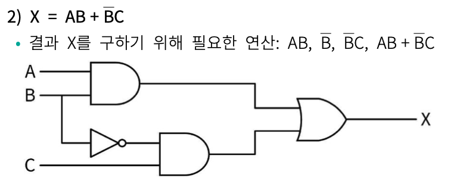

# 논리게이트로 만드는 논리회로

## 논리게이트
### 논리회로
- 반도체 소자를 이용하여 2진 정보를 입력받아 논리 연산 수행 결과를 출력하는 장치
- 논리게이트를 활용

### 논리게이트
- 논리회로를 구성하는 가장 기본 요소
- 불 연산에 대한 기호적 표시
- AND / OR / NOT
- NAND (AND 연산 전체를 부정) / NOR (OR 연산 전체를 부정) / XOR

### AND
$X = A \wedge B$

| A | B | X |
|:---:|:---:|:---:|
| 0 | 0 | 0 |
| 0 | 1 | 0 |
| 1 | 0 | 0 |
| 1 | 1 | 1 |

### OR
$X = A \vee B$

| A | B | X |
|:---:|:---:|:---:|
| 0 | 0 | 0 |
| 0 | 1 | 1 |
| 1 | 0 | 1 |
| 1 | 1 | 1 |

### NOT
$X = \overline{A}$
| A | X |
|:---:|:---:|
| 0 | 1 |
| 1 | 0 |

### NAND
$X = \overline{A \wedge B}$
| A | B | X |
|:---:|:---:|:---:|
| 0 | 0 | 1 |
| 0 | 1 | 1 |
| 1 | 0 | 1 |
| 1 | 1 | 0 |

### NOR
$X = \overline{A \vee B}$
| A | B | X |
|:---:|:---:|:---:|
| 0 | 0 | 1 |
| 0 | 1 | 0 |
| 1 | 0 | 0 |
| 1 | 1 | 0 |

### XOR
$X = A \oplus B = A'B + AB'$
| A | B | X |
|:---:|:---:|:---:|
| 0 | 0 | 0 |
| 0 | 1 | 1 |
| 1 | 0 | 1 |
| 1 | 1 | 0 |

### 논리 회로 그리기
$X = AB + \overline{B}C$

## 예제 문제
1. 논리게이트에는 어떤 것들이 있나요?
2. 논리 회로를 그려보세요.
	- $X = AB + A\vee (\overline{B}C)$

## 정답
1. AND, OR, NOT, NAND, NOR, XOR