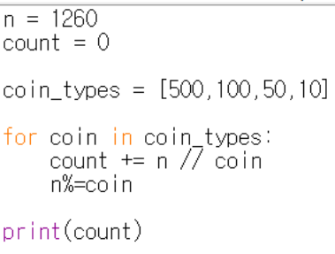
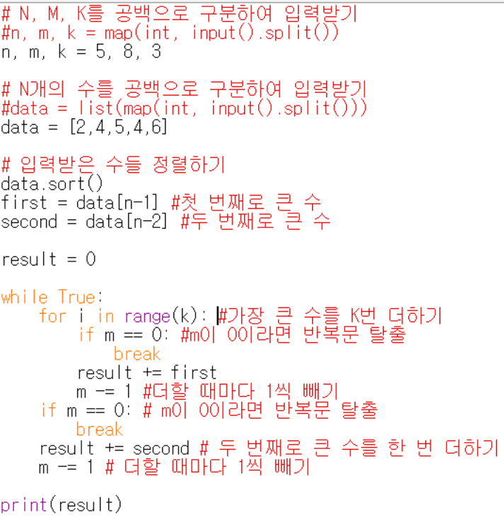
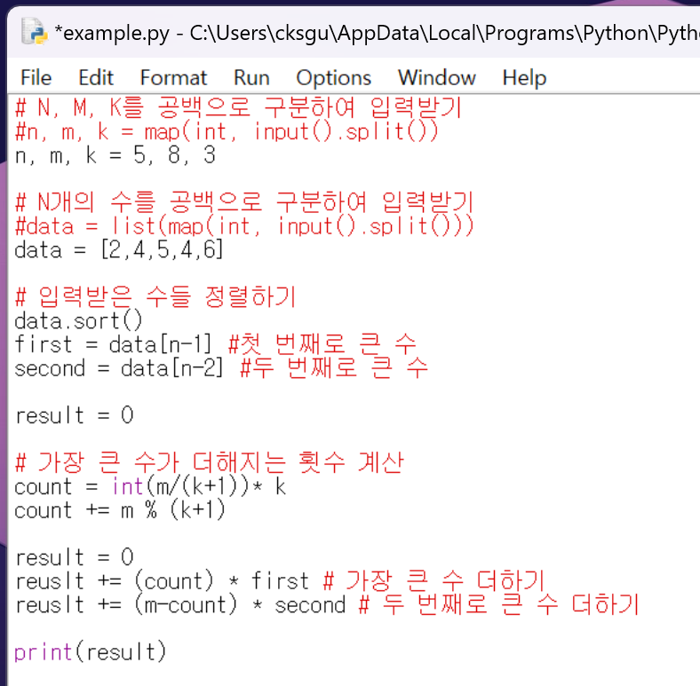

## 그리디

* 현재 상황에서 가장 좋아 보이는 것만을 선택하는 알고리즘
* 사전에 외우고 있지 않아도 풀 수 있을 가능성이 높은 문제 유형
* 기준에 따라 좋은 것을 선택하는 알고리즘, '가장 큰 순서대로' 와 같은 기준을 알게 모르게 제시해줌
* 자주 정렬 알고리즘과 짝을 이뤄 출제된다.

 

## '거스름돈' 문제 예시
* 거슬러 줘야 할 동전의 최소 개수를 구하라
* -> sol : 가장 큰 화폐 단위부터 돈을 거슬러 준다.

py. 답안 예시
 

* 그리디 알고리즘으로 해결할 수 있는 이유
- 가지고 있는 동전 중에서 큰 단위가 항상 작은 단위의 배수이므로 작은 단위의 동전들을 종합해 다른 해가 나올 수 없기 때문이다.
* 대부분의 그리디 알고리즘 문제에서는 최소한의 아이디어를 떠올리고 이것이 정당한지 검토할 수 있어야 답을 도출할 수 있다.

* 문제 유형을 파악하기 어렵다면, 그리디 알고리즘을 의심할 것.
* 그리디로도 안풀린다면, 다이나믹 프로그램이나, 그래프 알고리즘 등으로 문제를 해결할 것.

## 실전 문제 - 큰 수의 법칙
* 배열의 크기 : N
* 숫자가 더해지는 횟수 : M
* 배열의 특정한 인덱스(번호)에 해당하는 수가 연속해서 K번을 초과 불가
=> N,M,K에 따라서 동빈이의 큰 수의 법칙에 따른 결과

### 답안 예시

* 입력받은 수에서 가장 큰 수와 두 번째로 큰 수만 저장하면 된다.
* #1. 연속으로 더할 수 있는 횟수는 최대 K번이므로, 가장 큰 수를 K번 더하기
* #2. 두 번째로 큰 수를 한 번 더하는 연산을 반복하면 된다.
* 하지만 M이 10000이하이므로 이 방식으로는 문제를 해결할 수 있지만, M의 크기가 커진다면 시간 초과 판정을 받는다.

### 반복되는 수열에 대해서 파악
* 위의 예시로 따져보자
* 2,4,5,4,6 이라는 숫자가 있다. K번까지 반복될 수 있으며 M번 숫자를 번갈아가며 더해야한다.
* 위의 예시의 경우  6,6,6,5가 반복된다.
* K+1 개씩 묶여서 반복되는 것. (가장큰 값 K번 반복(K=3), 두 번째 1번 반복)
* M을 K+1로 나눈 몫이 **수열이 반복되는 횟수**가 된다. 
* 여기에 K를 곱해주면, 가장 큰 수가 등장하는 횟수가 된다. 
* M이 K+1로 나누어떨어지지 않는 경우도 고려 => M을 K+1로 나눈 나머지만큼 가장 큰 수가 추가로 더해지므로 이를 고려해주어야 함 
* 가장 큰 수가 더해지는 횟수 = int(M/(K+1))*K + M%(K+1)
* 이를 토대로 파이썬을 이용해 답안을 작성하면 다음과 같다.

