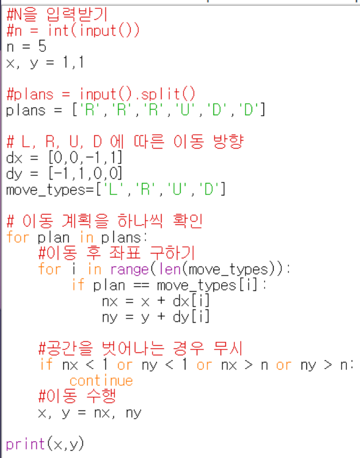
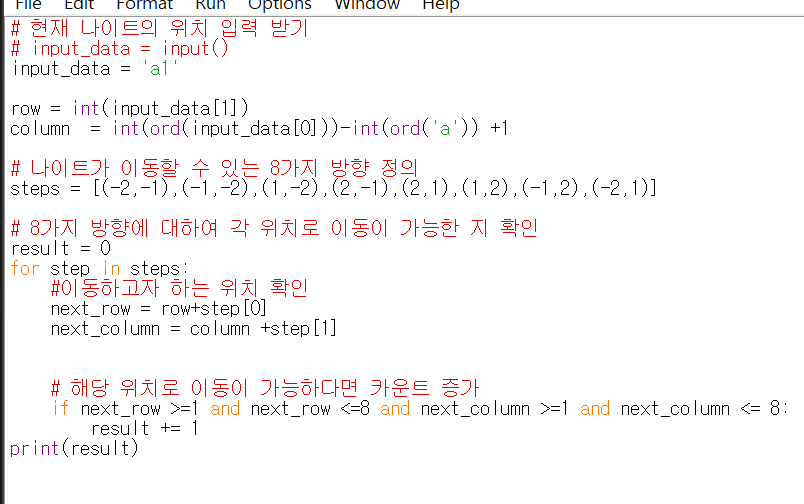

## 구현
* 머릿속에 있는 알고리즘을 정확하고 빠르게 프로그램으로 작성하기
* 완전 탐색, 시뮬레이션 유형을 '구현' 유형으로 묶어서 다루고 있다.

### 완전 탐색-bruteforce
* 모든 경우의 수를 주저 없이 다 해결하는 방법

### 시뮬레이션
* 문제에서 제시한 알고리즘을 한 단계씩 차례대로 직접 수행해야 하는 문제 유형

### 예제 4-1 상하좌우

계획서가 주어졌을 때, 여행가 a가 최종적으로 도착할 지점의 좌표를 출력하시오

입력 예시 
  5
  RRRUDD (L: 왼쪽, R: 오른쪽, U: 위, D: 아래)

 
출력 예시  
3,4  

### 실전 문제 - 왕실의 나이트
* 행복 왕국의 왕실 정원은 체스판과 같은 8X8 좌표 평면이다. 
* 나이트는 말을 타고 있기 떄문에, 일을 할 때는 L자 형태로만 이동할 수 있다.
* 1. 수평으로 두 칸 이동한 뒤에 수직으로 한 칸 이동하기
* 2. 수직으로 두 칸 이동한 뒤에 수평으로 한 칸 이동하기
* 좌표 평면에서 나이트의 위치가 주어졌을 때, 나이트가 이동할 수 있는 경우의 수를 출력하는 프로그램

Ex. 나이트가 a1에 있을 때, 이동할 수 있는 경우의 수는 2이다.
* 오른쪽으로 두 칸 이동 후, 아래로 한 칸 이동하기
* 아래로 두 칸 이동 후, 오른쪽으로 한 칸 이동하기

### How?
* 나이트는 두 가지 경로로 움직일 수 있다고 했다.
* 1. 수평으로 두 칸 이동한 뒤에 수직으로 한 칸 이동하기
* 2. 수직으로 두 칸 이동한 뒤에 수평으로 한 칸 이동하기
* 이동 경로를 steps 변수로 관리하자!
* steps = [(-2,-1),(-1, -2),(1,-2),(2,-1),(2,1),(1,2),(-1,2),(-2,1)]로 값을 대입할 수 있다. 
* 현재의 위치를 기준으로 아래쪽과 오른쪽은 양수의 값을, 위쪽과 왼쪽은 음수의 값을 대입한 결과이다.

* 아까와는 다르게 연속해서 움직이는 게 아니므로, 바뀐 값에 바뀐 값을 더하지 않는다.
* '상하좌우' 문제에서는 dx, dy 리스트를 선언하여 이동할 방향을 기록할 수 있도록 하였다.
* steps 변수가 dx, dy  변수의 기능을 대신하여 수행한다. 2가지 형태 모두, 자주 사용되므로, 참고하기!