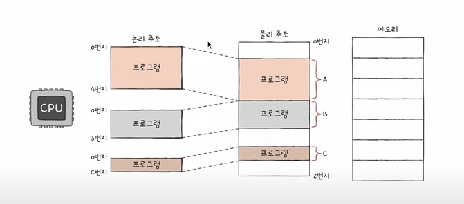
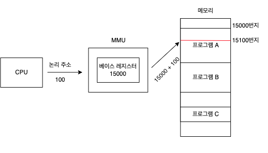
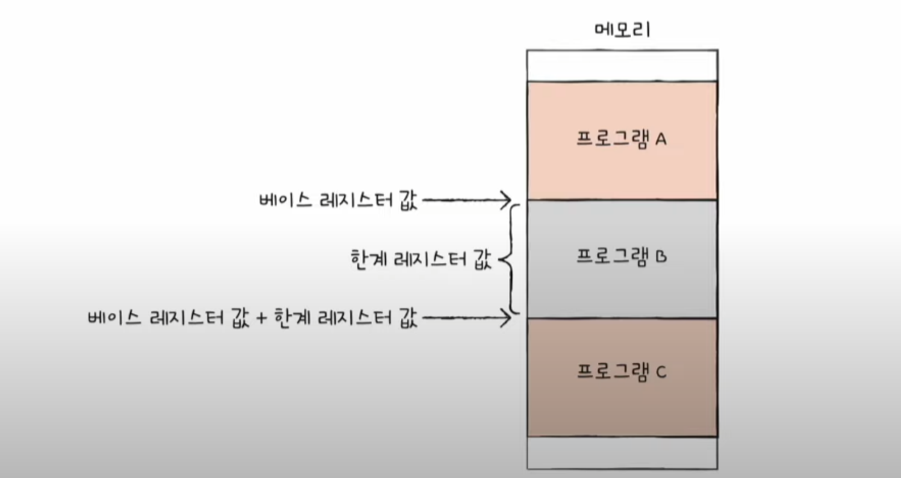
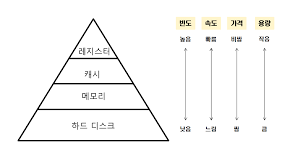

## 메모리
'메모리'라고 지칭한 하드웨어 => RAM

* RAM의 특성과 종류
* 논리 주소와 물리 주소

캐시 메모리, 저장 장치 계층 구조 -> CPU가 메모리에 접근하는 시간을 절약
    

## RAM의 특징과 종류

주기억 장치의 종류는 크게 **RAM, ROM** 두 가지가 있다.
 
그 중에서도 **'메모리'** 라는 용어는 **RAM** 을 지칭하는 경우가 많다.
    
## RAM 의 특징

* 실행할 프로그램의 명령어와 데이터가 저장된다.
* ⭐ 전원을 끄면 저장된 내용이 사라진다 -> **휘발성 저장 장치**  

전원이 꺼져도 저장이 유지되는 저장 장치 
  -> **비휘발성 저장 장치** (ex. SSD, CD-ROM, USB와 같은 **보조기억장치**)

보조기억장치는 전원을 꺼도 내용 유지 O
 CPU는 보조기억장치에 직접 접근할 수 없음

그래서 **보조기억장치(ex.USB)** 에는 **"보관할 대상"** 을 저장

**휘발성 기억장치(ex. RAM)** 에는  **"실행할 대상"** 을 저장

CPU <-> RAM(실행할 대상을 저장하는 곳, 휘발성 저장 장치) <-> 보조기억장치(보관할 대상을 저장하는 곳, 비휘발성 저장 장치)

-> CPU가 실행하고 싶은 프로그램이 보조기억장치에 있따면 RAM으로 복사하여 저장한 뒤 실행
    

### RAM의 용량과 성능

* CPU가 실행하고 싶은 프로그램이 보조기억장치에 있다면, 이를 RAM으로 가져와야 할 텐데, RAM 용량이 적다면 보조기억장치에서 실행할 프로그램을 자주 가져와야함 -> 실행 시간이 길어짐
* RAM 용량이 1이라면, 보조기억장치에서 복사해올 수 있는 프로그램이 1뿐
* RAM 용량이 3이라면, 보조기억장치에서 복사해올 수 있는 프로그램이 3. -> 프로그램을 여러 번 가져오는 수고를 덜 수 있음

=> But. RAM 용량이 크다해서 실행 속도는 그에 비례하지 않음
 어느정도 비례하는 것은 맞지만, 실행할 수 있는 프로그램이 100개이든, 실행할 수 있는 프로그램이 1000개이든 간에, RAM과 보조기억장치를 오가는 시간에는 별 차이가 없는 것과 마찬가지.

    
### RAM의 종류
* DRAM
* SRAM
* SDRAM
* DDR SDRAM

### DRAM
* Dynamic RAM의 준말
* 저장된 데이터가 동적으로 변하는 RAM
* 즉, 시간이 지나면 저장된 데이터가 점차 사라지는 RAM
* 데이터의 소멸을 막기 위해, 일정 주기로 데이터를 재활성화(다시 저장)해야 함
* 그럼에도 불구하고, 일반적으로 메모리로써 사용하는 RAM은 DRAM이다.
* 소비 전력이 비교적 낮고, 저렴하고, 집적도가 높기 때문에 대용량으로 설계하기가 용이함!

### SRAM
* Static RAM의 준말
* 저장된 데이터가 변하지 않는 RAM
* DRAM과 다르게 시간이 지나도 저장된 데이터가 사라지지 않음
* 주기적으로 재활성화 할 필요 X
* DRAM 보다 속도도 빠름
* but. 그럼에도 DRAM을 자주 사용함
* 왜냐. 집적도가 낮고, 소비 전력 큼, 가격도 비쌈
* 대용량으로 만들어질 필요는 없지만 속도는 빨라야 하는 저장 장치 => **캐시 메모리**에서 사용됨

### SDRAM
* 클럭 신호와 동기화된, 발전된 형태의 DRAM
* 위의 말은, 클럭(CPU가 속도를 나타내는 단위) 타이밍에 맞춰, CPU와 정보를 주고받을 수 있음을 의미한다.
* 클럭에 맞춰 작동하며, 클럭마다 정보를 주고받을 수 있는 **DRAM**

### DDR SDRAM
* 최근 흔히 사용되는 RAM
* 대역폭을 넓혀 속도를 빠르게 만든 **SDRAM**
* **대역폭**이란 데이터를 주고받는 길의 너비
* **한 클럭에 한 번씩 cPU와 데이터**를 주고받을 수 있는 **SDRAM**에 비해, **DDR SDRAM**은 너비가 두 배의 대역폭으로   **한 클럭당 두 번씩** CPU와 데이터를 주고받을 수 있다.
* DDR2 대역폭 4배, DDR3 대역폭 8배 -> 2의 배수 씩 늘어남

## 핵심 포인트
* **RAM**은 **휘발성 저장 장치**이고, **보조기억장치**는 **비휘발성 저장 장치**이다.
* **DRAM**은 시간이 지나면 **저장된 데이터가 점차 사라지는 RAM**
* **SRAM**은 시간이 지나도 **저장된 데이터가 사라지지 않는 RAM**
* **SDRAM**은 **클럭과 동기화된 DRAM**
* DDR SDRAM은 SDR SDRAM에 비해 대역폭이 두 배 넓다.

    
## 메모리의 주소 공간
* '메모리에 저장된 정보의 위치는 주소로 나타낼 수 있다'
* 주소는 두 종류가 있다. 
* 바로, '물리 주소'와 '논리 주소'이다.
* 물리 주소 : 메모리 하드웨어가 사용하는 주소
* 논리 주소 : CPU와 실행 중인 프로그램이 사용하는 주소

CPU는 실행중인 프로그램이 현재 메모리 몇 번지에 무엇이 저장되어 있는 지 모른다. 그 이유는 메모리에 저장된 정보는 시시각각 변하기 때문이다.

그리고 여러 프로그램이 실행되어 있다해도, 각 프로그램은 다른 프로그램의 물리주소가 무엇인지 굳이 알 필요가 없다.

그래서 메모장, 게임은 모두 물리 주소가 아닌 0번지부터 시작하는 자신만을 위한 주소인 논리 주소를 가지고 있다.

다시 말해,  
1) **물리 주소** : 정보가 실제로 저장된 **하드웨어 상의 주소**
2) **논리 주소** : 실행 중인 프로그램 **각각에게 부여된 0번지부터 시작되는 주소**

 

메모리가 사용하는 주소는 하드웨어상의 실제 주소인 물리 주소이고,
CPU가 실행 중인 프로그램이 사용하는 주소는 각각의 프로그램에 부여된 논리 주소이다.

그런데, CPU가 이해하는 주소가 논리 주소여도,
**CPU와 메모리와 상호작용**하려면 **논리 주소와 물리 주소 간의 변환**이 이루어져야 한다. 

이 때 변환은, 메모리 관리 장치(MMU)라는 하드웨어에 의해 수행된다.

프로그램 C의 데이터 삭제! 를 하였다고 생각해보면 되겠다.
적재된 프로그램 C의 논리 주소 100번지를 해당 사진처럼 접근이 가능하게 된 것.

베이스 레지스터는 프로그램의 가장 작은 물리 주소, 즉 프로그램의 첫 물리 주소를 저장하는 셈이고, 논리 주소는 프로그램의 시작점으로부터 떨어진 거리인 셈이다.

CPU가 발생시킨 논리 주소가 100번지라면, 이 논리 주소는 물리 주소 15100번지로 변환이 된다.

 

### 메모리 보호 기법

만약 메모장 1500번지에 숫자 100을 저장하라는 명령을 합니다.근데 메모장의 논리 주소는 0번지 999번지가 있다면, 이 명령은 실행되어도 안전할까요? 아닙니다.. 프로그램의 논리 주소 영역을 벗어났기 때문입니다.

이렇게 다른 프로그램의 영역을 침범할 수 있는 명령어는 위험하기 때문에 논리 주소 범위를 벗어나는 명령어 실행을 방지하는 방법이 필요합니다.

이는 **한계 레지스터** 라는 레지스터가 담당합니다.

따라서 프로그램 B의 베이스 레지스터 값은 프로그램 b의 메모리 주소 시작 값이라고 할 수 있고 한계 레지스터 값은 프로그램 b가 감당할 수 있는 레지스터의 범위라고 알 수 있겠습니다.

한계 레지스터는 논리 주소의 최대 크기를 저장합니다.

따라서 논리 주소값이, 한계 레지스터 값 (=논리 주소의 최대 크기) 를 벗어나면 안됩니다. 

논리 주소가 한계 레지스터 크게 되면, 인터럽트(트랩)이 발생하여 다른 프로그램의 주소 공간이 침범하지 못하도록 실행을 중단시킵니다.

실행 중인 프로그램의 독립적인 실행 공간을 확보하고 하나으 ㅣ프로그램이 달느 프로그램을 침범하지 못하게 보호할 수 있씁니다.

### 마무리
* **물리 주소**는 메모리 하드웨어 상의 주소이고, **논리 주소**는 CPU와 실행 중인 프로그램이 사용하는 주소이다.
* **MMU**는 논리 주소를 물리 주소로 변환한다.
* **베이스 레지스터**는 프로그램의 첫 물리 주소를 저장한다.
* **한계 레지스터**는 실행 중인 프로그램의 논리 주소의 최대 크기를 저장한다.

    

## 캐시 메모리
* CPU는 프로그램을 실행하는 과정에서 메모리에 저장된 데이터를 빈번하게 사용합니다.
* CPU가 메모리에 접근하는 시간은 cPU의 연산속도보다 느립니다.
* 아무리 연산을 빨리 해도 메모리에 접근하는 시간이 느리면 cPU의 빠른 연산 속도는 아무런 쓸모가 없다!
* 이를 극복하기 위한 저장 장치가 바로 **캐시 메모리**이다.

### 저장 장치 계층 구조
* CPU와 가까운 저장 장치는 빠르고, 멀리 있는 저장 장치는 느리다.
* 속도가 빠른 저장 장치는 저장 용량이 작고, 가격이 비싸다.
  
  

컴퓨터가 사용하는 저장 장친들은 'CPU에 얼마나 가까운가'를 기준으로 계층적으로 나타낼 수 있다.

### 캐시 메모리
* CPU와 메모리 사이에 위치하고, 레지스터보다 용량이 크고 메모리보다 빠른 SRAM 기반의 저장 장치
* cPU의 연산 속도와 메모리 접근 속도의 차이를 조금이나마 줄이기 위해 탄생
* 메모리에서 CPU가 사용할 일부 데이터를 미리 캐시 메모리로 가져와서 활용하자는 것
* 컴퓨터 내부에는 여러 개의 캐시 메모리가 있으며, CPU(코어)와 가장 가까운 캐시 메모리를 L1 캐시, 그 다음 L2 캐시, 그 다음 L3 캐시라고 부른다.
* 위의 L1, L2, L3 순서대로 데이터를 검색하게 된다.

### 참조 지역성 원리
* 캐시 메모리는 메모리에 있는 모든 내용을 가져다 저장할 수 x
* 캐시 메모리는 CPU가 사용할 법한 대상을 예측하여 저장한다.
* 보조기억장치 - 전원이 꺼져도 기억할 대상을 저장
* 메모리 - 실행 중인 대상을 저장

=> 자주 사용될 것으로 예측한 데이터가 실제로 들어맞아 캐시 메모리 내 데이터가 CPU에서 활용될 경우를 **캐시 히트**라고 한다.

=> 예측에 실패하면 **캐시 미스**

캐시 적중률 = 캐시 히트 횟수 / (히트 횟수 +미스 횟수)

### cpu가 사용할 법한 데이터를 어떻게 예측할 수 있을까?
참조 지역성의 원리라는 원칙이 존재한다.
1) cpu는 최근에 접근했던 메모리 공간에 다시 접근하려는 경향이 있다. **시간 지역성**이라고 한다.
2) Cpu는 접근한 메모리 공간 근처를 접근하려는 경향이 있다. 이를 **공간 지역성**이라고 한다.

예시. 

1) C언어의 FOR문 같은 변수의 여러 번 접근하게 되는 경우
2) 메모장과 같은 프로그램의 서로 관련 있는 데이터끼리 모여서 저장되는 경우, EX. 워드 프로세서 (자동 저장 기능, 입력 기능, 출력 기능) 

