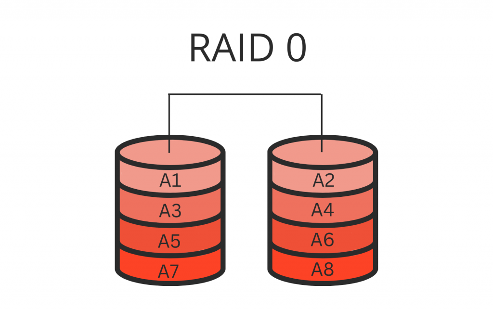
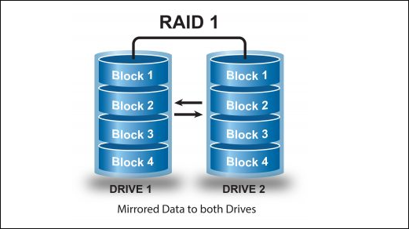
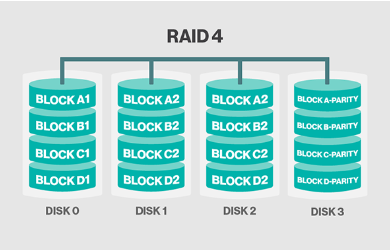
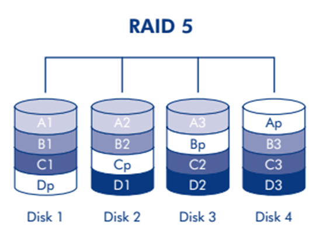
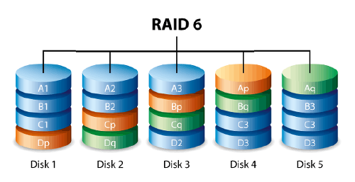

## 보조기억장치
* **하드디스크**와 **플래시 메모리**는 개인 컴퓨터부터 서버를 구성하고 관리하는 상황까지 다방면으로 사용되는 부품이기 때문에 잘 알아야 하는 저장장치이다.
* 두 장치에 관해 가볍게 알아보고, 높은 성능과 안전한 데이터 저장을 위한 RAID에 대해 학습한다.
    

### 하드 디스크
* 자기적인 방식으로 데이터를 저장하는 보조기억장치 이다.
* 자기 디스크의 일종으로 지칭하기도 한다.
* 하드 디스크를 뜯어보자면, 동그란 원판인 **플레터**가 있고, 그 플래터를 회전시키는 구성 요소를 **스핀들**이라고한다. 
* 스핀들이 플래터를 돌리는 속도를 분당 회전수를 나타내는 RPM이라는 단위로 표현된다.
* 플래터를 대상으로 데이터를 읽고 쓰는 구성 요소는 헤드이다.
* 헤드는 원하는 위치로 헤드를 이동시키는  디스크암에 부착되어 있다.
* CD나 Lp에 비해 하드 디스크는 훨씬 더 많은 양의 데이터를 저장해야 하므로 일반적으로 여러 겹의 플래터로 이루어져 있고, 양면을 모두 사용할 수 있다.

### 플래터에 데이터가 어떻게 저장 되는가?
* 플래터는 트랙과 섹터라는 단위로 데이터를 저장한다. 
* 플래터를 여러 동심원으로 나누었을 때, 그중 하나의 원을 트랙이라고 부른다.
* 여러 겹의 플래터가 사용될 수 있으며, 여러 겹의 플래터 상에서 같은 트랙이 위치한 곳을 모아 연결한 논리적 단위를 실린더라고 부른다.
* 플래터는 트랙과 섹터로 나뉘고, 같은 트랙이 모여 실린더를 이룬다.

**데이터가 하드 디스크의 섹터, 트랙, 실린더에 저장된다**
 
-> 하드 디스크가 저장된 데이터에 접근하는 시간은 크게 탐색 시간, 회전 지연, 전송 시간으로 나뉜다.

* **탐색 시간**은 접근하려는 데이터가 저장된 트랙까지 헤드를 이동시키는 시간을 의미한다.
* **회전 지연**은 헤드가 있는 곳으로 플래터를 회전시키는 시간을 의미한다.
* **전송 시간**은 하드 디스크와 컴퓨터 간에 데이터를 전송하는 시간을 의미한다.  

위 시간들은 성능에 큰 영향을 끼치는 시간이다.
앞서 말한 L1 캐시 참조 시간, 메모리 참조 시간에 비해 
하드 디스크 탐색 시간, 하드디스크에서 1MB를 순차적으로 읽는 시간이 훨씬 오래 걸린다.

탐색 시간과 회전 지연을 단축시키기 위해서는 플래터를 빨리 돌려 RPM을 높이는 것도 중요하지만, 접근하려는 데이터가 플래터 혹은 헤드를 조금만 옮겨도 접근할 수 있는 곳에 위치하는 것도 중요하다.

    
### 플래시 메모리
* 하드 디스크는 최근에 많이 사용하는 보조기억장치이지만, 플래시 메모리 기반의 보조기억장치 또한 많이 사용합니다.
* 우리가 사용하는 **USB 메모리, SD 카드, SSD가 모두 플래시 메모리 기반의 보조기억장치**입니다.
* 전기적으로 데이터를 읽고 쓸 수 있는 반도체 기반의 저장 장치입니다. 
* 보조기억장치 범주에만 속한다기보다는 다양한 곳에서 널리 사용하는 저장 장치로 보는 것이 옳습니다.
* 주기억장치 중 하나인 ROM에도 사용되고, 우리가 일상적으로 접하는 거의 모든 전자 제품 안에 플래시 메모리가 내장되어 있다.
* **셀이라는 단위가 있다. 이 셀이 모여 MB, GB, TB 용량을 갖는 저장 장치**가 된다.
* 한 셀에 **1비트**를 저장할 수 있는 플래시 메모리를 **SLC** 타입
* 한 셀에 **2비트**를 저장할 수 있는 플래시 메모리를 **MLC** 타입
* 한 셀에 **3비트**를 저장할 수 있는 플래시 메모리를 **TLC** 타입

### SLC 타입
* 한 셀로 두 개의 표현할 수 있다.
* 다른 타입에 비해 비트의 빠른 입출력이 가능하다.
* 수명도 길어서, 데이터를 쓰고 지우고를 반복할 수 있따.
* 하지만 가격이 높다. 그렇기에 기업에서 데이터를 읽고 쓰기가 많이 반복되는 빠른 저장 장치가 필요한 경우에 사용한다.

### MLC 타입
* 한 셀로 네 개의 정보를 표현할 수 있다. 
* 일반적으로 속도와 수명은 떨어지지만, 한 셀에 두 비트ㄹ씩 저장할 수 있다는 점에서 대용량화하기 유리하다.
* 가격이 비교적 저렴하며, 시중에서 사용되는 많은 플래시 메모리 저장장치들이 MLC타입으로 만들어진다.

### TLC 타입
* 한 셀당 3비트씩 저장할 수 있는 TLC 타입은 한 셀로 여덟 개의 정보를 표현할 수 있다. 대용화 하기가 유리하다.
* 용량대비 가격도 저렴하다. 

정리하면, 같은 용량의 플래시 메모리 저장 장치라고 할지라도 셀의 타입에 따라 가격, 성능, 수명이 다르다.

썼다 지우기를 자주 반복한다면 **고가의 SLC**

저가의 대용량 저장 장치를 원한다면 **TLC 타입**

그 중간을 원한다면 **MLC 타입**

### 셀보다 더 큰 단위로 알아보자면?
* 셀이 모여서 만들어진 단위를 **페이지**
* 페이지가 모여 만들어진 단위를 **블록**
* 블록이 모여 **플레인**, 플레인이 모여 **다이**가 된다.

플래시 메모리에서 읽기와 쓰기는 **페이지 단위**로 이루어진다.
 
삭제는 페이지보다 큰 블록 단위로 이루어진다.
 
읽기/쓰기 단위와 삭제 단위가 크기가 다르다는 것이 특징이다.

이 때 페이지는 세 개의 상태를 가질 수 있습니다.

* Free 상태 : 어떠한 데이터도 저장하고 있지 않아, 새로운 데이터를 저장할 수 있는 상태
* Valid 상태 : 이미 유효한 데이터를 가지고 있는 상태
* Invalid 상태 : 쓰레기값이라 부르는 유효하지 않은 데이터를 가지고 있는 상태

 

### Invalid 페이지는 어떻게 되는가?

* 하드 디스크와는 달리 덮어쓰기가 불가능하여 Valid 상태인 페이지에는 새 데이터를 저장할 수 없다.
* 덮어쓰기가 된다면 Invalid 페이지로 변화하게 되며, 덮여쓰려고 했던 데이터는 새로운 데이터 공간에 저장이 된다.
* Invalid 페이지로 변한 공간은 사용하지 않을 공간인데도 불구하고 용량을 차지하고 있다. -> 그렇다고 해당 페이지만 지울 수도 없다. 왜냐하면 삭제는 블럭 단위로만 되기 때문이다.
* 최근 SSD를 비롯한 플래시 메모리는 이런 쓰레기값을 정리하기 위해 **가비지 컬렉션 기능을 제공**한다.

### 가비지 컬렉션
1) 유효한 페이지들만을 새로운 블록으로 복사한 뒤, 
2) 기존의 블록을 삭제하는 기능. 
* 즉, 블록 X의 모든 유효현 페이지를 새로운 블록 Y로 옮기고 X를 삭제하는것.

### 마무리
* 하드 디스크의 구성 요소에는 **플래터, 스핀들, 헤드, 디스크 암**이 있다.
* 플래터는 **트랙**과 **섹터**로 나뉘고, 여러 **플래터의 동일한 트랙이 모여 실린더**를 이룬다.
* 히드 디스크의 데이터 접근 시간은 크게 **탐색 시간**, **회전 지연**, **전송 시간**으로 나뉜다.
* 플래시 메모리는 한 셀에 몇 비트를 저장할 수 있느냐에 따라 **SLC, MLC, TLC**로 나뉜다.
* 플래시 메모리의 **읽기와 쓰기**는 **페이지 단위**로, **삭제**는 **블록 단위**로 이루어진다.

    

## RAID의 정의와 종류

### 시작하기 전에
* 1TB 하드 디스크 네 개 동시에 사용 vs 4TB 하드 디스크 사용하는 것이 나을것인지.
* 1TB 하드 디스크 네 개로 RAID를 구성하면, 4TB 하드 디스크 한 개의 성능과 안정성을 능가할 수 있다.

### RAID 정의
* 수많은 정보를 어떻게 관리할 것인가?
* 보조기억장치에도 수명이 있다.
* 그렇다고 하드 디스크랑 보조기억장치에도 어떻게든 저장만 저장은 다소 부족한 해법
* 이럴 때 사용할 수 있는 방법 중 하나가 RAID이다.

 

* RAId는 주로 하드 디스크와 SSD를 사용하는 기술
*  데이터의 안정성 혹은 높은 성능을 위해 여러 개의 물리적 보조기억장치를 마치 하나의 논리적 보조기억장치처럼 사용하는 기술
  

### RAID의 종류
* 하드 디스크나 SSD를 마치 하나의 장치처럼 사용하는 RAID를 구성하는 방법은 여러 가지가 있다.
* 이 구성 방법을 **RAID 레벨**이라 한다.
* RAID 레벨에는 대ㅐ표적으로 RAID 0, RAID 1, RAID 2, RAID 3, RAID 4, RAID 5, RAID 6이 있고, . . 그 후로 파생된 RAID 50이 있다.

### RAID 0

* RAID 0은 여러 개의 보조기억장치에 데이터를 단순히 나누어 저장하는 구성 방식
* 어떠한 데이터를 저장할 때 각 하드 디스크는 아래와 같이 번갈아 가며 데이터를 저장한다.
* 즉, 저장되는 데이터가 하드 다스크 개수만큼 나뉘어 저장된다.
* 이 때, 줄무늬처럼 분산되어 저장된 데이터를 **스트라입**이라 하고, 분산하여 저장하는 것을 **스트라이핑** 이라고 한다.

 

* 위와 같이 데이터가 분산되어 저장되면, 다시 말해 스트라이핑되면 저장된 데이터를 읽고 쓰는 속도가 빨라진다
* 하나의 대용량 저장 장치를 이용했더라면 여러번에 걸쳐 읽고 썼을 데이터를 동시에 읽고 쓸 수 있기 때문이지요.
* 그렇기에 4TB 저장 장치 한 개를 읽고 쓰는 속도보다 RAID 0로 구성된 1TB 저장 장치 네 개의 속도가 이론상 네 배가량 빠르다.

 

* RAID 0에는 단점이 있다. 저장된 정보가 안전하지 않다. 디스크 하나에 문제가 생기면 다른 모든 하드 디스크의 문제가 생길 수 있다.
* 그렇게 등장한 것이 RAID 1

  

### RAID 1

* 복사본을 만드는 반식
* 마치 거울처럼 완전한 복사본을 만드는 구성이기에 **미러링**이라고도 부른다.
* RAID 0처럼 스트라이핑이 사용되긴 했지만, 오른쪽의 두 하드 디스크는 마치 거울처럼 왼쪽의 두 하드 디스크와 동일한 내용을 저장하고 있다.
* RAID 1에 어떠한 데이터를 쓸 떄는 원본과 복사본 두 군데에 쓴다. 그렇게에 RAID 0보다 느리다.
* 복구가 매우 간단하다는 장점이 있다.
* 하지만 개수가 한정되었을 때, 사용 가능한 용량이 적어지는 단점이 있다. 
* but 정보의 양이 반만 저장할 수 있다는 단점이 존재한다. 결국 많은 양의 하드 디스크가 필요하게 되고, 비용이 증가한다.

### RAID 4

* RAID 1처럼 완전한 복사본을 만드는 대신 오류를 검출하고 복구하기 위한 정보를 저장한 장치를 두는 구성 방식입니다.
* **오류를 검출하고 복구하기 위한 정보를 패리티 비트**라고 한다.
* RAID 4는 RAID 1보다 적은 하드 디스크로도 데이터를 안전하게 보관할 수 있습니다. 

### RAID 5

* 어떤 새로운 데이터가 저장될 때마다 패리티를 저장하는 디스크에도 데이터를 쓰게되므로 패리티를 저장하는 장치에 병목이 발생한다는 문제가 있다.
* 패리티 정보를 분산하여 저장하는 방식으로, RAID 4의 문제인 병목 현상을 해소한다.

### RAID 6

* 구성은 RAID 5와 같으나, 다음 그림과 같이 서로 다른 두 개의 패리티를 두는 방식이다. 
* 오류를 검출하고 복구할 수 있는 수단이 두 개 생긴 것
* RAID 5보다 안전한 구성이라 볼 수 있다.
* 새로운 정보를 저장할 때마다 패리티가 두 개 생기므로, 쓰기 속도는 RAID 5보다 느리다. 
* 데이터 저장 공간을 희생하더라도 데이터를 안전하게 보관하고 싶을 때 사용하는 방식이다.

  
**각 레벨마다 장단점이 있으므로 어떤 상황에서 무엇을 최우선으로 원하는 지에 따라 최적의 RAID 레벨은 달라질 수 있다. 그렇기에 특징을 잘 알아야 한다.**

  

## 마무리
* **RAID**란 데이터의 안정성 혹은 높은 성능을 위해 여러 하드 디스크나 SSD를 마치 하나의 장치처럼 사용하는 기술
* **RAID 0**은 데이터를 단순히 병렬로 분산하여 저장하고, **RAID 1**은 완전한 복사본을 만든다.
* **RAID 4는** 패리티를 저장한 장치를 따로 두는 방식이고, **RAID 5는** 패리티를 분산하여 저장하는 방식이다.
* **RAID 6은** 서로 다른 두 개의 패리티를 두는 방식이다.