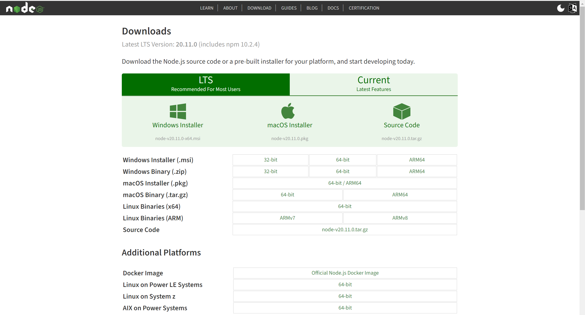

# 데이터

CS101에서 나오지 않은 것들을 위주로..

## 워드

vscode, node.js 등 무언가를 다운받을 때 몇비트인지에 따라 받는 파일이 다름을 알 수 있다.

이 비트는 현재 CPU가 처리할 수 있는 워드의 크기로, 이 워드를 기준으로

절반 크기는 하프 워드

1배 크기는 풀 워드

2배 크기를 더블 워드라 부른다.

## 이진수의 음수표현

0과 1로만 음수를 표현하기 위한 방법으로 2의 보수를 사용한다.

여기서 2의 보수는 이진수의 1을 0으로, 0을 1로 바꾼 후 여기서 1을 더하면 된다.

## 문자 집합과 인코딩

- 문자 집합: 컴퓨터가 인식하고 표현할 수 있는 문자의 모음
- 문자 인코딩: 문자를 2진수로 변환하는 과정
- 문자 디코딩: 2진수를 문자로 변환하는 과정

## EUC-KR

한글 인코딩 방식에는 조합형, 완성형이 존재한다.

여기서 EUC-KR은 KS X 1001, KS X 1003이라는 문자 집합을 기반으로 한 대표적인 완성형 인코딩 방식이다.

한글 단어의 크기는 2바이트이다.

하지만 모든 단어를 표현할 수 없다(뿱, 쀓, 믜 등).

그래서 이를 해결하기 위해 마이크로소프트에서 CP949를 만들었지만, 한글 전체를 표현하기 위한 넉넉한 양은 아니었다.

## 유니코드, UTF-8

유니코드는 한국어 뿐만 아니라 다양한 언어와 기호들을 지원한다.

그리고 글자에 부여된 값 자체를 인코딩된 값으로 삼지 않고 이 값을 다양한 방법으로 인코딩한다.

여기서 UTF-8, UTF-16, UTF-32 등이 있다.
