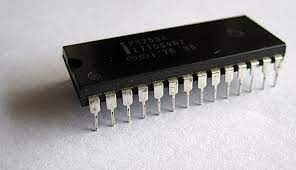

# 입출력

장치 컨트롤러와 장치 드라이버 개념을 통해 외부 장치가 컴퓨터 내부와 어떻게 소통하는가

## 장치 컨트롤러

입출력 장치가 CPU, 메모리보다 다루기 까다로운 이유

1. 입출력 장치의 종류가 너무 많다.

   각 장치마다 정보를 주고 받는 방식을 규격화 하기 어렵다.

2. 일반적으로 CPU와 메모리의 데이터의 전송률은 높지만 입출력장치의 데이터 전송률은 너무 낮다.

   전송률: 데이터를 얼마나 빨리 교환 할 수 있는가

   서로 전송률이 달라 통신이 어렵다.

그래서 컴퓨터에 직접 입출력 장치를 연결하지 않고 장치 컨트롤러라는 하드웨어를 통해 연결한다.

장치 컨트롤러는 다음과 같은 역할을 한다.

- CPU와 입출력장치 간의 통신 중개
- 오류 검출
- 데이터 버퍼링

여기서 데이터 버퍼링은 전송률이 높은 장치와 낮은 장치 사이에 주고 받는 데이터를 버퍼라는 임시 저장 공간에 저장하여 전송률을 비슷하게 맞추는 방법이다.

장치 컨트롤러의 내부에는

- 데이터 레지스터
  - CPU와 입출력장치 사이에 주고받을 데이터가 담기는 레지스터이다.
  - 이 레지스터가 앞서 말한 버퍼 역할을 한다.
  - 최근에는 데이터가 많은 입출력 장치에 RAM을 사용하기도 한다.
- 상태 레지스터
  입출력장치가 입출력 작업을 할 준비가 되었는지, 입출력 작업이 완료되었는지, 입출력장치에 오류는 없는지 등의 상태 정보가 저장된다.
- 제어 레지스터
  입출력장치가 수행할 내용에 대한 제어 정보와 명령을 저장한다.

세가지가 있다.

## 장치 드라이버

장치 컨트롤러의 동작을 감지하고 제어함으로써 장치 컨트롤러가 컴퓨터 내부와 정보를 주고받을 수 있게 하는 프로그램

입출력장치를 연결하기 위한 소프트웨어적인 통로다.

드라이버는 운영체제에서 드라이버를 인식하고 실행할 수 있다면 컴퓨터 내부와 정보를 주고받을 수 있다.

그리고 따로 입출력 장치 제작자가 장치 드라이버를 만들기도 한다.

## 프로그램 입출력

기본적으로 프로그램 속 명령어로 입출력장치를 제어하는 방법이다.

CPU가 프로그램 속 명령어를 실행하는 과정에서 입출력 명령어를 만나면 CPU는 입출력장치에 연결된 장치 컨트롤러와 상호작용하며 입출력 작업을 수행한다.

메모리에 저장된 정보를 하드디스크에 백업하는 상황으로 입출력으로 살펴보면 다음과 같다.

1. CPU는 하드디스크 컨트롤러의 제어 레지스터에 쓰기 명령을 보낸다.
2. 하드 디스크 컨트롤러는 하드 디스크 상태를 확인한다. 하드 디스크가 준비된 상태면 하드 디스크 컨트롤러는 상태 레지스터에 준비되었다고 표시한다.
3. CPU는 상태 레지스터를 주기적으로 읽어보며 하드디스크의 준비 여부를 확인한다.
4. 하드디스크가 준비되었음을 CPU가 확인하면 백업할 메모리의 정보를 데이터 레지스터에 쓴다.
5. 쓰기가 끝나면 작업을 종료한다.

여기서 여러 장치 컨트롤러 속 레지스터들을 모두 알고 있기는 어렵다.

그렇다면 CPU는 명령어를 어떻게 표현하고 메모리에 어떻게 저장할까?

### 메모리 맵 입출력

메모리에 접근하기 위한 주소 공간과 입출력장치에 접근하기 위한 주소 공간을 하나의 주소 공간으로 간주하는 방법이다.

예를 들어, 1024개의 주소 공간이 있다면, 메모리, 입출력장치를 위한 공간 512개씩 지정한다.

여기서 메모리 맵 입출력 방식에서 CPU는 메모리의 주소들이나 장치 컨트롤러의 레지스터들이나 모두 똑같이 메모리 주소를 대하듯 하면 된다는 점이다.

그래서 입출력장치와 메모리에 접근하는 명령어는 굳이 다를 필요가 없다.

### 고립형 입출력

메모리를 위한 주소 공간과 입출력장치를 위한 주소 공간을 분리하는 방법이다.

입출력장치, 메모리 둘다 주소 공간을 최대로 활용할 수 있다.

CPU가 메모리 읽기/쓰기 선이 활성화되는 명령어를 실행할 때는 메모리에 접근하고 입출력 장치 읽기/쓰기 선이 활성화 되는 명령어를 실행할 때 장치 컨트롤러에 접근한다.

고립형 입출력에서 CPU의 메모리와 입출력장치에 접근하는 명령어가 다르다.

## 인터럽트 기반 입출력

입출력 장치가 아닌 컨트롤러에 의해 발생한다.

CPU는 장치 컨트롤러에 입출력 작업을 명령하고, 장치 컨트롤러가 입출력 장치를 제어하며 입출력을 수행하는 동안 CPU는 다른 일을 할 수 있다.

장치 컨트롤러가 입출력을 끝내 CPU에게 인터럽트 요청을 보내면 CPU는 하던 일을 잠시 백업하고 인터럽트 서비스 루틴을 실행한다.

### 폴링

주기적으로 장치 컨트롤러의 상태 레지스터를 확인하며 입출력장치의 상태를 확인한다.

CPU의 부담이 인터럽트 보다 크다.

### 입출력장치가 많은 경우

CPU가 플래그 레지스터 속 인터럽트 비트를 활성화한 채 인터럽트를 처리하는 경우

다른 입출력 장치에 의한 하드웨어 인터럽트를 받아들이지 않기 때문에

CPU는 순차적으로 하드웨어 인터럽트를 처리하게 된다.

플래그 레지스터 속 인터럽트 비트가 활성화되어 있는 경우,

혹은 인터럽트 비트를 비활성화해도 무시할 수 없는 인터럽트인 **NMI(Non-Maskable Interrupt)**가 발생한 경우

CPU는 우선순위가 높은 인터럽트부터 처리한다.

우선순위를 반영하여 다중 인터럽트를 처리하는 방법 중 많은 컴퓨터가 사용하는 벙법은 **프로그래머블 인터럽트 컨트롤러(PIC)**라는 하드웨어를 사용하는 것이다.

PIC는 여러 인터럽트들의 요청 순위를 판별한 뒤 CPU에 지금 처리해야할 하드웨어 인터럽트가 무엇인지 알려주는 장치이다.

각 핀에는 CPU에 하드웨어 인터럽트 요청을 보낼 수 있는 약속된 하드웨어가 연결되어 있다.

그렇다면 처러과정은 어떻게 될까?

1. PIC가 장치 컨트롤러에서 **인터럽트 요청 신호**를 받아들인다.
2. 인터럽트 우선순위를 판단한 뒤 CPU에 처리해야할 **인터럽트 요청 신호**를 보낸다.
3. CPU는 PIC에 **인터럽트 확인 신호**를 보낸다.
4. PIC는 데이터 버스를 통해 CPU에 **인터럽트 벡터**를 보낸다.
5. CPU는 인터럽트 벡터를 통해 인터럽트 요청의 주체를 알게 되고, 해당 장치의 **인터럽트 서비스 루틴**을 실행한다.

일반적으로 더 많은 인터럽트를 관리하기 윟 ㅐPIC를 두 개 이상 계층적으로 구성한다.

참고로 PIC는 NMI(우선순위가 가장 높다.)까지 우선순위를 판별하지는 않는다.

## DMA 입출력

입출력과 메모리 사이에 전송되는 모든 데이터가 반드시 CPU를 거쳐야 한다면 CPU는 입출력장치를 위한 연산때문에 시간을 뺏기게 된다.

그래서 메모리가 CPU를 거치지 않고 상호작용할 수 있는 입출력 방식인 DMA(Direct Memory Access)가 등장했다.

DMA 입출력을 하기 위해서는 시스템 버스에 연결된 DMA 컨트롤러라는 하드웨어가 필요하다.

### DMA 입출력 과정

1. CPU는 DMA 컨트롤러에 입출력장치의 주소, 수행할 연산, 읽거나 쓸 메모리의 주소 등과 같은 정보로 입출력 작업을 명령한다.
2. DMA컨트롤러는 CPU 대신 장치 컨트롤러와 상호작용하며 입출력 작업을 수행한다. 이떄 DMA 컨트롤러는 필요한 경우 메모리에 직접 접근하여 정보를 읽거나 쓴다.
3. 입출력 작업이 끝나면 DMA컨트롤러는 CPU에 인터럽트를 걸어 작업이 끝났음을 알린다.

이를 통해 CPU는 작업 명령을 내리고 인터럽트만 받으면 되기 때문에 작업 부담을 훨씬 줄일 수 있다.

그러나 DMA 컨트롤러는 시스템 버스로 메모리에 직접 접근이 가능하지만

시스템 버스는 동시 사용이 불가능하다.

그러니까 CPU가 시스템 버스를 사용하면 DMA 컨트롤러는 시스템 버스를 사용불가하다는 이야기다.

그래서 DMA 컨트롤러는 CPU가 시스템 버스를 이용하지 않을 때 마다 조금씩 시스템 버스를 이용하거나 CPU가 일시적으로 시스템 버스를 이용하지 않도록 허락을 구하고 시스템 버스를 집중적으로 이용하기도 한다.(CPU입장에서는 시스템 버스에 접근하는 주기를 도둑맞는 것 처럼 느껴 사이클 스틸링이라고 부른다.)

### 입출력 버스

CPU가 DMA 컨트롤러 때문에 시스템 버스를 사용하지 못하게 되는 것을 막기 위해 **입출력 버스**라는 별도의 버스에서 연결하여 해결할 수 있다.

요즘 대부분의 컴퓨터에는 입출력 버스가 존재한다.

그래서 입출력 버스는 입출력장치를 컴퓨터 내부와 연결짓는 통로라고도 볼 수 있다.

입출력 버스에는 **PCI(Peripheral Component Interconnect) 버스**, **PCI Express(PCIe) 버스** 등 여러 종류가 있다.

최근에 메모리에 직접 접근할 뿐만 아니라 입출력 명령어를 직접 인출하고 해석하고 실행까지 하는 일종의 입출력 전용 CPU가 만들어졌다.

이를 입출력 프로세서, 입출력 채널이라 부른다.

입출력 채널이 있는 컴퓨터는 CPU가 명령어를 실행하지 않는다.

CPU가 입출력 채널에게 메모리에 저장된 특정 입출력 명령어를 수행하라고 지시하면, 입출력 채널은 해당 입출력 명령어를 인출하고, 해석하고, 실행한 뒤, 인터럽트를 통해 결과를 CPU에게 알린다.
