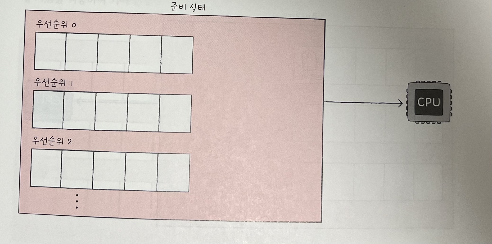
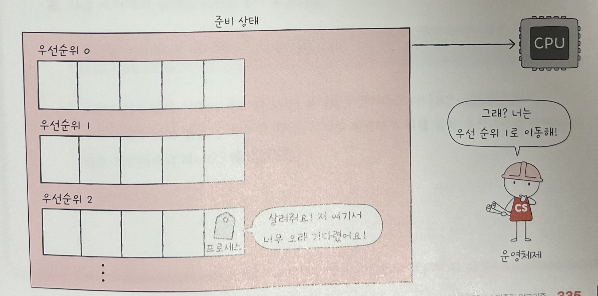
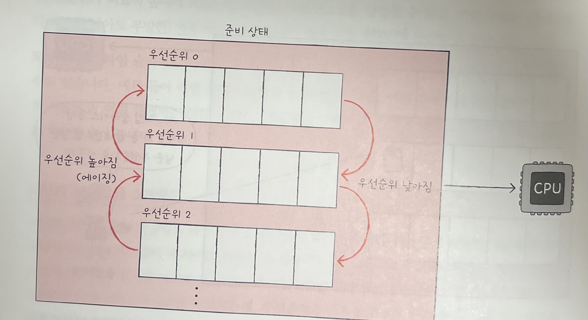

## CPU 스케줄링
* 모든 프로세스를 CPU를 필요로 하고, 먼저 CPU를 사용하고 싶어 한다.
* 운영체제가 프로세스들에게 공정하고 합리적으로 CPU 자원을 배분하는 것을 **CPU 스케줄링** 이라고 한다. 

### 프로세스 우선순위
* 프로세스들에게 공정하게 CPU를 배분하려면 어떻게 해야할까?
* CPU를 사용하고 싶어 하는 프로세스들이 차례로 돌아가며 CPU를 이용하게 하는 방법이 있다.
* 하지만 이는 좋은 방법이 아니다. **우선순위** 가 다르기 때문이다.
* 우선순위가 높은 프로세스란 빨리 처리해야하는 프로세스들을 의미한다.
* 대부분의 프로세스들은 CPU와 입출력장치를 모두 사용하며 실행된다. -> 프로세스는 실행 상태와 대기 상태를 반복하며 실행된다.

### 입출력 집중 프로세스 & CPU 집중 프로세스
* 비디오 재생이나 디스크 백업 작업을 담당하는 프로세스 - **입출력 집중 프로세스**
* 복잡한 수학 연산, 컴파일 등의 작업을 담당하는 프로세스 - **CPU 집중 프로세스**

* **입출력 집중 프로세스** 는 실행 상태보다는 입출력을 위한 대기 상태에 더 많이 머무르게 된다.
* **CPU 집중 프로세스** 는 대기 상태보다는 실행 상태에 더 많이 머무르게 된다.
* CPU를 이용하는 작업을 **CPU 버스트** 라고 한다.
* 입출력장치를 기다리는 작업을 **입출력 버스트** 라고 부른다.
* 즉, 프로세스는 일반적으로 CPU 버스트와 입출력 버스트를 반복하며 실행된다.

* CPU 집중 프로세스와 입출력 집중 프로세스가 모두 동일한 빈도로 CPU를 사용하는 것은 비합리적이다.

* 입출력 집중 프로세스는 잠깐 실행하면 당분간 대기 상태로 접어들기 때문에 입출력 집중 프로세스를 가능한 한 빨리 진행시켜 입출력장치를 끊임없이 작동시키고, 그 다음 CPU 집중 프로세스에 집중적으로 CPU를 할당하는 것이 더 효율적이다.

* CPU를 차례대로 돌아가며 사용하는 것보다, 각각의 상황에 맞게 CPU를 배분하는 것이 효율적이다.
* 그렇게 때문에 프로세스의 중요도에 맞게 프로세스가 CPU를 이용할 수 있도록 프로세스마다 **우선순위** 를 부여한다. 

* 운영체제는 PCB에 우선순위를 명시하고, PCB에 적힌 우선순위를 기준으로 먼저 처리할 프로세스를 결정한다.
* -> 자연스럽게 우선순위가 높은 프로세스는 더 빨리, 더 자주 실행된다.

### 스케줄링 큐
* PCB에 우선순위가 적혀 있다고는 하지만, 운영체제가 모든 프로세스의 PCB를 뒤적거리는 것은 비효율적이다.
* 그래서 운영체제는 프로세스들에 '줄을 서서 기다릴 것'을 요구한다. 
* CPU를 사용하고 싶은 프로세스들을 줄 세우는 것. 운영체제는 이 줄은 **스케줄링 큐**로 구현하고 관리한다.
* 즉, 운영체제는 메모리로 적재되고 싶은 프로세스들을 큐에 삽입하여 줄을 세웁니다.
* 운영체제가 관리하는 대부분의 자원은 이렇듯 큐로 관리된다.
* 큐에는 다양한 종류가 있는데, 대표적인 큐로 **준비 큐**와 **대기 큐**가 있다.
* **준비 큐** : CPU를 이용하고 싶은 프로세스들이 서는 줄
* **대기 큐** 는 입출력장치를 이용하기 위해 대기 상태에 접어든 프로세스들이 서는 줄
***

* 준비 상태에 있는 프로세스들의 PCB는 준비 큐의 마지막에 삽입되어 CPU를 사용할 차례를 기다린다. 

* 운영체제는 PCB들이 큐에 삽입된 순서대로 프로세스를 하나씩 꺼내어 실행하되, 그중 우선순위가 높은 프로세스를 먼저 실행한다.

* 대기 상태에 있는 프로세스도 마찬가지이다. 같은 장치를 요구한 프로세스들은 같은 대기 큐에서 기다린다.

* ex. 하드 디스크 사용을 요구한 프로세스는 하드 디스크 대기 큐에서 입출력 작업이 완료되기를 기다리고, 프린터 사용을 요구한 프로세스는 프린터 대기 큐에서 입출력 작업이 완료되기를 기다리는 것이다.

* 입출력이 완료되어 완료 인터럽트가 발생하면 대기 큐에서 발생한 완료된 PCB를 찾고, 이 PCB를 준비 상태로 변경한 뒤 대기 큐에서 제거한다. 당연히 해당 PCB는 준비 큐로 이동한다.

### 선점형과 비선점형 스케줄링
* 해당 프로세스가 CPU를 잘 사용하고 있는 도중에, 다른 급한 프로세스가 CPU를 지금 당장 사용하길 요청한다면 어떻게 할 것인가?
* CPU 자원을 빼앗아 다른 프로세스에 할당할 수 도 있고, CPU를 사용 중인 프로세스의 작업이 끝날 때까지 다른 급한 프로세스를 기다리게 할 수도 있다.

### 선점형 스케줄링
* '남보다 앞서서 차지함'을 의미한다.
* 프로세스가 CPU를 비롯한 자원을 사용하고 있더라도 운영체제가 프로세스로부터 자원을 강제로 빼앗아 다른 프로세스에 할당할 수 있는 스케줄링 방식
* 문맥 교환이 자주 일어나, 오버헤드가 발생할 수 있다.

### 비선점형 스케줄링
* 하나의 프로세스가 자원을 사용하고 있다면 그 프로세스가 종료되거나 스스로 대기 상태에 접어들기 전까진 다른프로세스가 끼어들 수 없는 스케줄링 방식
* 하나의 프로세스가 자원을 사용중이라면, 무작정 기다리는 수 밖에 없다는 단점이 있다.

***
* 대부분의 운영체제는 선점형 스케줄링 방식을 차용하고 있다.

### 핵심 마무리
* CPU 스케줄링은 공정하고 합리적으로 CPU 자원을 배분하는 방법을 의미
* 프로세스는 우선순위를 가지고 있고, 이는 PCB에 명시된다.
* 운영체제는 효율적인 스케줄링을 위해 스케줄링 큐를 사용한다.
* 준비 큐는 CPU 할당을 기다리는 프로세스들을 위한 큐를 의미
* 대기 큐는 입출력장치를 기다리는 프로세스들을 위한 큐를 의미
* 선점형 스케줄링은 프로세스가 이용 중인 자원을 빼앗을 수 있다.
* 비선점형 스케줄링은 프로세스가 이용 중인 자원을 빼앗을 수 없다.

### CPU 스케줄링 알고리즘
* 운영체제마다 서로 다른 알고리즘 사용 중.
* 각 스케줄링 알고리즘들의 작동 방식과 장단점을 이해하는 데에 집중.
* 종류는 매우 다양하며, 일곱 가지 스케줄링 알고리즘을 설명

### 선입 선처리 스케줄링 (FCFS)
* FCFS (Frist come First Schduling) 스케줄링 이라고도 부름. 
* CPU를 먼저 요청한 프로세스부터 CPU를 할당하는 스케줄링 방식
* 가장 공정해 보이지만, 시간이 길어질 수 있다.
* 비선점형 스케줄링이 - 공정해보이지만, 프로세스들이 기다리는 시간이 매우 길어짐
* 이런 긴 시간을 기다려여만 하는 현상을 **호위 효과** 라고 함

### 최단 작업 우선 스케줄링 (SJF)
* CPU를 먼저 요청한 프로세스부터가 아닌 실행 시간이 짧은 프로세스 먼저 실행한다.
* SJF, Shortest Job First Scheduling 이라고 한다.
* 최단 작업 우선 스케줄링은 기본적으로 비선점형 스케줄링 알고리즘으로 분류되지만, 선점형으로 구현될 수도 있다. (뒤에 나올, 선점형 최단 작업 우선 스케줄링)

### 라운드 로빈 스케줄링
* 선입 선처리 스케줄링(FCFS)에 타임 슬라이스 개념이 더해진 스케줄링 방식
* 타임 슬라이스란 각 프로세스가 CPU를 사용할 수 있는 정해진 시간을 의미한다.
* 정해진 타임 슬라이스만큼의 시간 동안 돌아가며 CPU를 이용함
* 삽입된 순서대로 PU를 이용하되, 정해진 시간만큼만 CPU를 이용함 -> 그렇기 때문에 문맥 교환이 발생
* 타임 슬라이스 크기가 매우 중요함. 크기가 지나치게 크면 사실상 위의 FCFS와 
크게 달라질 게 없음
* 크기가 작으명, 문맥 교환에 발생하는 비용이 커 CPU 처리하는 일보다 프로세스를 전환하는 데에 힘을 쏟기 때문

### 최소 잔여 시간 우선 스케줄링
* SRT(Shrotest Remaining Time)스케줄링은 최단 작업 우선 스케줄(SJF)이랑 알고리즘과 라운드 로빈(FCFS+타임슬라이스) 알고리즘을 합친 스케줄링 방식이다.
* 최소 시간 잔여 시간 우선으로, 정해진 타임 슬라이스만큼 CPU를 사용하되, CPU를 사용한 다음 프로세스는 남아있는 작업 시간이 적은 프로세스가 선택됨

### 우선 순위 스케줄링
* 프로세스들에 우선순위를 부여하고, 가장 높은 우선순위를 가진 프로세스부터 실행하는 스케줄링 알고리즘
* SJF, 최소 시간 잔여 시간 우선 스케줄링이 이에 해당됨
* 우선순위가 높은 프로세스들에 의해 실행이 계속해서 연기될 수 있다. 이를 **기아 현상** 이라고 한다.
* 이를 방지하기 위한 방법으로 **에이징** 이 있다. 오랫동안 대기한 프로세스의 우선순위를 점차 높이는 방식

### 다단계 큐 스케줄링
* 우선순위 스케줄링의 발전된 형태
* 다단계 큐 스케줄링은 우선순위별로 준비 큐를 여러 개 사용하는 스케줄링 방식

* 우선 순위 0에 삽입된 프로세스들, 우선순위 1에 삽입된 프로세스들, 우선순위2에 삽입된 프로세스들 순서대로 CPU를 할당받아 실행
* 유형별로 우선순위를 구분하여 실행하는 것이 편리해짐

### 다단계 피드백 큐 스케줄링

* 다단계 큐 스케줄링의 경우, 오래 기대린 프로세스는 계속 연기될 여지가 있다. 프로세스들이 큐 사이를 이동할 수 없기 때문.
* 이를 보완한 알고리즘
* 비슷하게 작동하지만, 다른 점이 있다.
* 바로, 프로세스들이 큐 사이를 이동할 수 있다는 점
* CPU를 비교적 오래 사용해야 하는 CPU  집중 프로세스들은 자연스레 우선순위가 낮아짐.
* CPU를 비교적 적게 사용하는 입출력 집중 프로세스들은 자연스레 우선순위가 높은 큐에서 실행이 끝남

* 너무 오래 기다리고 있는 프로세스가 있다면, 점차 우선순위가 높은 큐로 이동시키는 **에이징 기법** 을 이용해서 기아 현상 예방 가능
* 가장 구현이 복잡하지만, 가장 일반적인 CPU 스케줄링 알고리즘

### 핵심 포인트
* 선입 선처리 스케줄링(FCFS) 알고리즘 - 준비 큐에 삽입된 순서대로 CPU를 할당
* 최단 작업 우선 스케줄링(SJF) 알고리즘 - 준비 큐에 삽입된 프로세스들 중 CPU 사용 시간의 길이가 가장 짧은 프로세스부터 CPU를 할당
* 라운드 로빈 스케줄링 - 정해진 만큼만 돌아가며 CPU를 할당
* 우선순위 스케줄링 - 가장 높은 우선순위를 가진 프로세스에 CPU를 할당
* 다단계 피드백 큐 스케줄링 - 프로세스들이 큐 사이를 이동할 수 있어, 경우에 따라 우선순위를 이동시키면서 스케줄링

