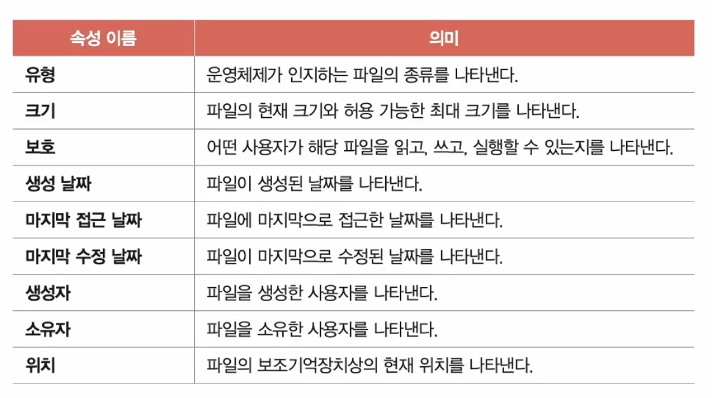
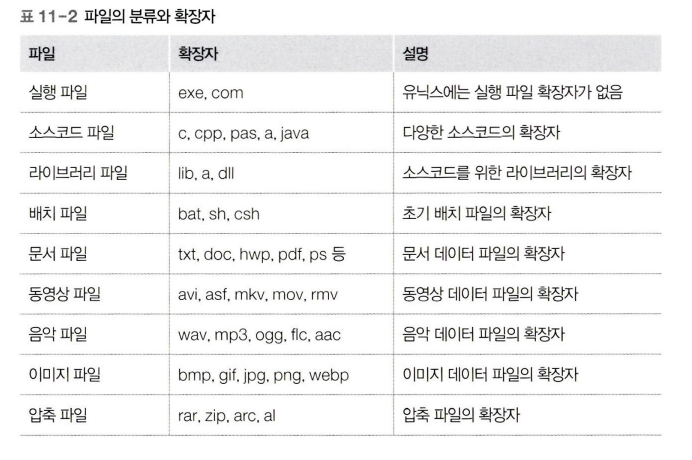

# 파일 시스템

## 파일과 디렉터리

### 파일

우리가 컴퓨터를 이용할 때 파일 단위를 사용한다.

파일이란 하드 디스크나 SSD와 같은 보조기억장치에 저장된 관련 정보의 집합을 의미한다.

파일을 이루는 정보에는 다음과 같은 것들이 있다.

- 이름
- 파일을 실행하기 위한 정보
- 속성
- 메타데이터

실제 윈도우 기준 파일에 오른쪽 클릭 후 속성을 누르면 다양한 정보가 나오는데, 이를 파일 속성이라 한다.

### 파일 속성과 유형

운영체제마다 유지하는 파일 속성은 조금씩 차이가 있지만 대표적인 속성은 다음과 같다.

파일 속성 중 파일 유형은 운영체제가 인식하는 파일 종류를 나타낸다.

그래서 파일 이름 뒤에 확장자를 통해 어떤 파일인지 나타낸다.

### 파일 연산을 위한 시스템 호출

어떤 응용 프로그램도 임의로 파일을 조작할 수 없고, 파일을 다루려면 운영체제에게 부탁해야 한다.

그래서 운영체제는 다음과 같은 연산을 위한 시스템 호출을 제공한다.

- 파일 생성
- 파일 삭제
- 파일 열기
- 파일 닫기
- 파일 읽기
- 파일 쓰기

### 디렉터리

파일들을 일목요연하게 관리하기 위해 디렉터리를 이용할 수 있다.

윈도우는 폴더라 부른다.

옛날 운영체제는 하나의 디렉터리만 존재했다.

모든 파일이 하나의 디렉터리 아래에만 있었고 이를 **1단계 디렉터리**라 부른다.

하지만 이런 방식은 파일을 관리하기 어렵기 때문에 디렉터리 안에 디렉터리와 같은 구조를 가진 **트리 구조 디렉터리**가 생겨났다.

최상위 디렉터리는 **루트 디렉터리**라 부르고 슬래시로 표현한다.

그렇다 보니 자연스레 **경로**라는 개념이 생겼다.

경로는 디렉터리를 이용해 파일 위치, 나아가 파일 이름을 특정 짓는 정보이다.

### 절대경로와 상대 경로

루트 디렉터리부터 자기 자신까지 이르는 고유한 경로를 가지고 있고, 이런 경로를 **절대 경로**라 부른다.

경로를 나타내는 다른 방법으로 **상대 경로**가 있다.

상대 경로는 현재 디렉터리부터 시작하는 경로이다.

### 디렉터리 연산을 위한 시스템 호출

파일처럼 디렉터리도 시스템 호출을 제공한다.

- 생성
- 삭제
- 열기
- 닫기
- 읽기

### 디렉터리 엔드리

많은 운영체제에서 디렉터리를 그저 특별한 형태의 파일로 간주한다.

그래서 디렉터리의 내부에는 해당 디렉터리에 담겨있는 대상과 관련된 정보를 담고 있다.

그리고 이 정보는 테이블 형태로 구성된다.

그래서 각 테이블의 행에는 폴더나 파일의 위치 등을 표현한다.

### 상대 경로 표현법

대부분 운영체제에는 현재 작업 디렉터리를 마침표로 끝내고, 현재 작업 디렉터리의 상위 디렉터리를 마침표 두번으로 나타낸다.

그래서 다음과 같이 표현이 가능하다.

`./main/bin/c.b`

cmd파일에서 `cd 하위폴더 이름`이라는 명령어를 통해 하위 폴더로 이동 가능하다.

그리고 `cd ..` 을 통해 상위 폴더로 이동 가능하다.(다만 루트 폴더는 상위 폴더가 없기 때문에입력해도 제자리다.)

## 파일 시스템

### 파티셔닝과 포매팅

새로 생성된 보조기억장치에 곧바로 파일을 생성하거나 저장할 수 없다.

왜냐면 **파티셔닝**과 **포매팅** 작업을 거쳐야 하기 때문이다.

- 파티셔닝
  저장 장치의 논리적인 영역을 구획하는 작업이다.
  이렇게 파티셔닝 작업을 통해 나눈 영역 하나하나를 **파티션**이라 한다.
  실제로 윈도우에 하드 디스크 파티션 만들기 및 포맷을 입력하면 보조기억장치가 어떻게 파티셔닝되는지 볼 수 있다.
- 포매팅
  저장 장치를 완전히 삭제하는 것으로 알고 있는 사람들이 많지만, 사실 이는 정확한 표현이 아니다.
  포매팅이란 파일 시스템을설정하여 어떤 방식으로 파일을 저장하고 관리할 것인지 결정하고
  새로운 데이터를 쓸 준비를 하는 작업을 의미한다.
  예를 들어 USB메모리를 포매팅할 때 파일 시스템을 설정하라는 화면을 볼 수 있다.
  파일 시스템에는 여러 종류가 있고 파티션마다 다른 파일 시스템을 설정할 수 있다.
  사실 포매팅을 완료하여 판매하는 경우도 있어 익숙하지 않으나 보조기억장치를 관리하거나 운영체제를 설치하는 과정에서 파티셔닝과 포매팅은 자주 접하게 될 키워드이니 기억하는 것이 좋다.
  ### 파일 할당 방법
  하드디스크의 포매팅이 끝나면 이제 저장 장치에 우리가 사용할 파일을 저장할 것이다.
  운영체제는 파일과 디렉터리를 블록 단위로 읽고 쓴다.
  파일의 크기에 따라 저장되는 블록의 수가 정해진다.
  이 때 파일을 보조기억장치에 저장하는 방법에 두가지가 있다.
  - **연속 할당**
    말 그대로 연속적인 블록에 파일을 할당하는 방식이다.
    그래서 연속 할당을 사용하는 파일 시스템에서는 디렉터리 엔트리에 파일 이름과 더불어 첫 번째 블록 주소와 블록 단위의 길이를 명시한다.
    하지만 이런 방식은 외부 단편화를 야기한다.
  - **불연속 할당**
    - **연결 할당**
      각 블록의 일부에 다음 블록의 주소를 저장하여 각 블록이 다음 블록을 가리키는 형태로 할당하는 방식이다.
      그래서 이 데이터를 연결 리스트 형식으로 관리한다.
      이 방식은 불연속 할당의 일종이기에 파일이 여러 블록에 흩어져도 무방하다.
      하지만 이 방식에 여러 단점이 있다.
      1. 반드시 첫 번째 블록부터 하나씩 차례대로 읽어야 한다.

         파일의 중간 부분부터 읽고 싶어도 반드시 첫 번째 블록부터 차례대로 읽어야 한다.

         다시 말해 임의 접근 속도가 매우 느리다.

      2. 하드웨어 고장이나 오류 발생 시 해당 블록 이후 블록은 접근할 수 없다.

         말 그대로 다음 블록에 접근할 수 없으므로 파일 자체를 사용할 수 없다.
      이를 해결하기 위해 오늘날에는 FAT 파일 시스템을 사용한다.
    - **색인 할당**
      파일의 모든 블록 주소를 **색인 블록**이라는 하나의 블록에 모아 관리하는 방식이다.
      위에서 본 연결 할당 방식은 임의 접근을 하나하나 탐색하며 접근해야 하지만, 색인 할당은 바로 첫번째 블록에서 접근 가능하다.
      그래서 색인 할당을 사용하는 파일 시스템에서는 디렉터리 엔트리 파일 이름과 더불어 **색인 블록 주소**를 명시한다.
      이 색인 할당을 기반으로 만든 파일 시스템이 유닉스 파일 시스템이다.

### 파일 시스템 살펴보기

저용량 장치에서 FAT 파일 시스템을 사용하고,

유닉스 계열 운영체제에서 유닉스 파일 시스템을 사용할 수 있다.

- FAT 파일 시스템
  연결 리스트의 단점을 보완하기 위해 **파일 할당 테이블(File Allocation Table, FAT)**을 사용한다.
  그래서 디렉터리 엔트리에 첫 번째 블록주소만 명시하고 나머지 블록 주소는 파일 할당 테이블을 참고하면 된다.
  실제로 옛날 마이크로소프트 운영 체제인 MS-DOS에서 사용되었고
  최근 USB, SD카드 같은 저용량 저장 장치용 파일 시스템으로 많이 이용되고 있다.
  참고로 윈도우에서는 블록 대신 클러스터라는 용어를 사용한다.
  FAT 파일 시스템에서 파티션을 간략하게 표현하면 다음과 같다.
  `예약 영역` - `FAT 영역` - `루트 디렉터리 영역` - `데이터 영역`
  만약 FAT가 메모리에 적재된 채 실행되면 임의 접근의 성능이 개선된다.
  FAT의 디렉터리 엔트리는 조금 더 자세히 살펴보면 다음과 같다.
  `파일 이름` - `확장자` - `속성` - `예약 영역` - `생성 시간` - `마지막 접근 시간` - `마지막 수정 시간` - `시작 블록` - `파일 크기`
  파티션에서 트리 구조인 폴더들을 따라가면 해당 파일 이름을 포함한 첫번째 블록 주소가 나오는데, 그 블록 주소를 참고하여 블록에 접근한다.
- 유닉스 파일 시스템
  색인 할당은 색인 블록을 기반으로 파일의 데이터 블록들을 찾는 방식인데, 유닉스 파일 시스템에서 색인 블록을 i-node라 부른다.
  i-node는 15개의 블록 주소가 저장될 수 있는데, 만약 15개가 넘어가면 다음과 같은 방법으로 해결한다.
  1. i-node의 블록 주소 중 12개는 직접 블록 주소를 저장한다.
  2. 모든 주소를 가리킬 수 없으면 열세번째 블록 주소를 사용하여 **단일 간접 블록** 주소를 저장한다.

     단일 간접 블록에는 여러개의 데이터를 가리킨다.

  3. 열네번째 주소에는 이중 간접 블록 주소를 저장한다.

     이중 간접 블록은 단일 간접 블록들의 주소가 저장되어 있다.

  4. 열다섯번째 주소에는 삼중 간접 블록 주소를 저장한다.

     삼중 간접 블록은 이중 간접 블록들의 주소가 저장되어 있다.

     여기까지 가면 왠만한 크기의 파일은 모두 저장된다.
  유닉스 파일 시스템의 파티션은 다음과 같은 구조를 가진다.
  `예약 영역` - `i-node 영역` - `데이터 영역`
  여기서 데이터 영역의 루트 디렉터리의 i-node번호를 참고하여 접근하고 하는 파일에 순차적으로 이동한다.

파일 시스템은 윈도우에서 **NT 파일 시스템(NTS)**, 리눅스에서 **ext 파일 시스템** 등이 있다.
