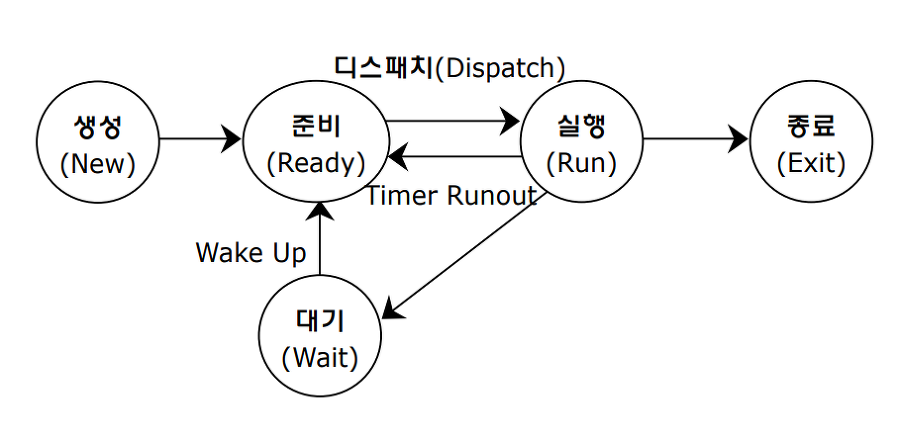
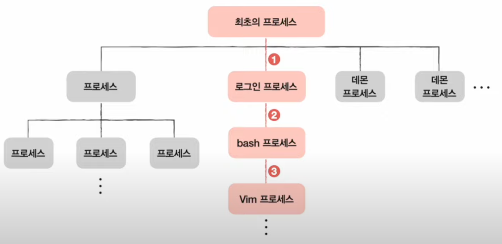

# 프로세스와 스레드

### 프로세스
* '실행중인 프로그램' -> 프로세스
* 프로그램은 실행되기 전까지는 그저. 보조기억장치에 있는 데이터 덩어리
* 보조기억장치에 저장된 프로그램을 메모리에 적재하고 실행하는 순간, 그 프로그램은 **프로세스** 가 됩니다. -> 이 과정을 **프로세스를 생성한다.** 라고 표현한다.
* 컴퓨터가 부팅되는 순간부터 수많은 프로세스들이 실행된다.
* 사용자가 보는 앞에서 실행되는 프로세스 == **포그라운드 프로세스**
* 사용자는 보지 못하는 뒷 편에서 실행되는 프로세스 == **백그라운드 프로세스**
* 백 그라운드 프로세스 중에는 **사용자와 직접 상호작용하는 백그라운드 프로세스**도 있지만, 사용자와 **상호작용하지 않고 그저 묵묵히 정해진 일만 수행하는 백그라운드 프로세스**도 있다.
* 이를 유닉스 체계의 운영체제에서는 **데몬**이라고 부르고, 윈도우 운영체제에서는 **서비스**라고 부른다.

### 프로세스 제어 블록
* 모든 프로세스는 실행을 위해 CPU를 필요로 하지만, 자원은 한정되어 있다.
* 자신의 차례가 되면 정해진 시간만큼 CPU를 이용하고, 시간이 끝났음을 알리는 인턴럽트가 발생하면 자신의 차례를 양보하고 다음 차례가 올 때까지 기다린다.
* 운영체제는 빠르게 번갈아 수행하는 프로세스의 실행 순서를 관리하고, 자원을 배분한다. -> 이를 위해 운영체제는 **프로세스 제어 블록(PCB)** 를 이용한다.
* 이는 프로세스와 관련된 정보를 저장하는 자료 구조이다.
* 상품에 달린 태그와도 같다. 해당 프로세스를 식별하기 위해 꼭 필요한 정보들이 저장된다.
* PCB는 커널 영역에 생성되며, 운영체제는 수많은 프로세스들 사이에서, PCB로 특정 프로세스를 식별하고 해당 프로세스를 처리한다.
* PCB는 프로그램 생성 시에 만들어지고, 실행이 끝나고 폐기됨

 

* 프로세스가 생성되었다 => 운영체제가 PCB를 생성했다.
* 프로세스가 종료되었다 => 운영체제가 해당 PCB를 폐기했다.

 

### 프로세스 ID(Proces ID)
* 특정 프로세스를 식별하기 위해 부여하는 고유한 번호
* 같은 일을 수행하는 프로그램이라 할지라도 두 번 실행하면 PID 가 다른 두 개의 프로세스가 생성된다.

### 레지스터 값
* 프로세스는 실행 차례가 돌아오면 이전까지 사용했던 레지스터의 중간값들을 모두 복원한다. 왜냐하면 이전까지 진행했떤 작업들을 그대로 이어올 수 있기 때문
* PCB 안에는 해당 프로세스가 실행하며 사용했던 프로그램 카운터를 비롯한 레지스터 값들이 담긴다.

### 프로세스 상태
* 현재 프로세스가 어떤 상태인지도 PCB에 기록해야 함
* 입출력장치를 사용하기 위해 기다리는 것이닞, CPU를 이용하고 있는 상태인지 등등

### CPU 스케줄링 정보
* 프로세스가 언제, CPU로 할당받을지에 대한 정보도 PCB에 기록된다.

## 메모리 관리 정보
* 프로세스마다 메모리에 저장된 위치가 다르다. 프로세스가 어느 주소에 저장되어 있는 지에 대한 정보가 있어야 한다. PCB에는 **베이스 레지스터, 한계 레지스터 값** 과 같은 정보들이 담긴다. 하나의 페이지 테이블 정보(프로세스의 메모리 주소를 알 수 있는 정보)도 PCB에 담긴다.

### 사용한 파일과 입출력장치 목록
* 어떤 입출력장치가 이 프로세스가 할당되었는지, 어떤 파일들을 열었는지에 대한 정보들이 PCB에 기록된다.
* 운영체제는 커널 영역에 적재된 PCB를 보고 프로세스를 관리한다.

### 문맥 교환
* 하나의 프로세스 수행을 재개하기 위해 기억해야 할 정보를 문맥(context)라고 한다.
* 하나의 프로세스 문맥은 해당 프로세스의 PCB에 표현되어 있다.
* 프로세스가 CPU를 사용할 수 있는 시간이 다 되거나 예기치 못한 상황이 발생하여 **인터럽트** 가  발생하면 운영체제는 해당 프로세스의 PCB에 문맥을 백업한다.

* 기존 프로세스의 문맥을 PCB에 백업하고, 새로운 프로세스를 실행하기 위해 PCB로부터 복구하여 새로운 프로세스를 실행하는 것.

* 문맥 교환이 자주 일어나면 프로세스는 그만큼 빨리 번갈아가며 수행되기 때문에 프로세스들이 동시에 실행되는 것처럼 보인다.

* but. 너무 자주하면 오버헤드가 발생할 수 있기 때문에 자주 일어난다고 해서 좋은 건 아님.

### 프로세스의 메모리 영역
* 프로세스가 생성되면 커널 영역에 PCB가 생성됨
* 사용자 영역에는 프로세스가 어떻게 배치될까?
* 코드 영역, 데이터 영역, 힙 영역, 스택 영역으로 나뉘어 저장된다.

### 코드 영역
* 텍스트 영역이라고도 부름, 말 그대로 실행할 수 있는 코드
* 기계어로 이루어진 명령어가 실행된다.
* CPU가 실행할 명령어가 담겨 있기 떄문에, 쓰기가 금지되어 있다.

### 데이터 영역
* 유지할 데이터가 저장되는 공간
* 전역변수가 대표적이다.
* 프로그램이 실행되는 동안 유지되며, 프로그램 전체에서 접근할 수 있는 변수
* 코드 영역과 데이터 영역은 그 크기가 변하지 않는다. -> '크기가 고정된 영역' -> **정적 할당 영역** 이라고 부른다.
* 반면 힙 영역과 스택 영역은 크기가 변할 수 있기 때문에 **동적 할당 영역**이라고 부른다.

### 힙 영역
* 프로그램을 만드는 사용자, 즉 프로그래머가 직접 할당할 수 있는 저장 공간
* 메모리 공간을 할당했다면, 언젠가는 해당 공간을 반환해야 함
* 메모리 공간을 반환하지 않는다면, **메모리 누수** 가 발생함.

### 스택 영역
* 데이터를 일시적으로 저장하는 공간
* 잠깐 쓰다가 말 값들이 저장됨, 함수의 실행이 끝나면 사라지는 매개 변수, 지역 변수가 대표적임
* 일시적으로 저장할 데이터는 스택 영역에 PUSH 되고, 더 이상 필요하지 않은 데이터는 POP 됨으로써 스택 영역에서 사라진다.

* 힙 영역과 스택 영역은 실시간으로 그 크기가 변할 수 있기에 **동적 할당 영역** 이라고 부른다.

* 일반적으로 힙 영역은 메모리의 낮은 주소에서 높은 주소로 할당되고, 스택 영역은 높은 주소에서 낮은 주소로 할당된다. -> 그래야 데이터가 쌓여도, 새롭게 할당되는 주소가 겹칠 일이 없기 때문이다.

### 핵심 포인트
* 프로세스는 실행 중인 프로그램이다. 프로세스의 종류에는 포그라운드 프로세스와 백그라운드 프로세스가 있다.
* 운영체제는 프로세스 제어블록(PCB)을 통해 여러 프로세스를 관리한다.
* 프로세스 간에 실행을 전환하는 것을 문맥 교환이라고 한다.
* 프로세스 사용자 영역에 크게 코드 영역, 데이터 영역, 스택 영역, 힙 영역으로 나뉘어 배치된다.

    

## 프로세스 상태와 계층 구조
* 프로세스는 저마다의 상태가 있다.
* 운영체제는 이런 프로세스의 상태를 PCB에 기록하여 관리한다. 동시에 실행되는 수많은 프로세스를 계층적으로 관리한다.

### 프로세스 상태
* 하나의 프로세스는 여러 상태를 거치며 실행된다.
* 운영체제는 프로세스의 상태를 PCB를 통해 인식하고 관리한다.

### 생성 상태
* 프로세스를 생성중인 상태
* 이제 막 메모리에 적재되어 PCB를 할당 받은 상태

### 준비 상태
* 당장이라도 CPU를 할당받아 실행할 수 있겠지만, 자신의 차례가 아니기에 기다리고 있는 상태
* 준비 상태인 프로세스가 실행 상태로 전환되는 것을 **디스패치** 라고 한다.

### 실행 상태
* CPU를 할당받아 실행 중인 상태
* 실행 상태인 프로세스는 할당된 일정 시간 동안만 CPU를 사용할 수 있다. 이때 프로세스가 할당된 시간을 모두 사용하면 다시 준비 상태가 되고, 실행 도중 입출력장치를 이용하여 입출력 장치의 작업이 끝날 때까지 기다려야 한다면 대기 상태가 된다.

### 대기 상태
* 실행 도중 입출력장치를 사용하는 경우가 있습니다. 
* 입출력 작업은 CPU에 비해 속도가 느리기에, 입출력 작업을 요청한 프로세스는 입출력 장치가 끝낼 때까지 기다려야 한다. -> 이러한 상태를 **대기 상태** 라고 한다.

### 종료 상태
* 프로세스가 종료된 상태
* 프로세스가 종료되면 운영체제는 PCB와 프로세스가 사용한 메모리를 정리한다.

### 프로세스 상태 다이어그램

* 컴퓨터 내의 여러 프로세스는 생성, 준비, 실행, 대기, 종료 상태를 거치며 실행된다. 운영체제는 이 상태를 PCB에 기록하며 프로세스를 관리함

### 대기 상태의 일반적인 정의
* 특정 이벤트가 일어나길 기다릴 때 프로세스는 대기 상태가 된다.
* 프로세스가 대기 상태가 되는 대부분의 원인이 입출력 작업이기 때문에, 프로세스가 입출력 작업을 하면, 대기 상태가 된다 라고 생각

### 프로세스 계층 구조
* 프로세스는 실행 도중 시스템 호출을 통해 다른 프로세스를 생성할 수 있다.
* 새 프로세스를 생성한 프로세스 **부모 프로세스**
* 부모 프로세스에 의해 생성된 프로세스 **자식 프로세스**
* 부모 프로세스와 자식 프로세스는 엄연히 다르기 때문에 각기 다른 PID를 가진다.
* 자식 프로세스의 PCB에 부모 프로세스의 PID인 PPID가 기록되기도 한다.

* 많은 운영체제는 이처럼 프로세스가 프로세스를 낳는 계층적인 구조로써 프로세스들을 관리한다.
* 최초의 프로세스가 자식 프로세스를 생성하고, 자식 프로세스가 새로운 프로세스를 낳는 형식이다.

### 프로세스 계층 구조

* 예시 : 사용자가 컴퓨터를 키고 1) 로그인 창을 통해 2) 성공적으로 로그인을 해서 bash 셸로 3) 문서 편집기 프로그램을 실행한다.

1) 컴퓨터를 켠 순간에 생성된 프로세스는 로그인을 담당하는 자식 프로세스로 생성한 것
2) 로그인 프로세스는 사용자 인터페이스 프로세스(bash셸) 프로세스를 자식 프로세스로 생성한 것
3) 사용자 인터페이스 프로세스는 Vim 프로세스를 생성한 셈

* note : 데몬이나 서비스 또한 최초 프로세스의 자식 프로세스

### 프로세스 생성 기법
* 부모 프로세스를 통해 생성된 자식 프로세스들은 **복제와 옷 갈아입기** 를 통해 실행된다.
* 부모 프로세스는 fork를 통해 자신의 복사본을 자식 프로세스로 생성해냄
* 만들어진 복사본(자식 프로세스)는 exec을 통해 자신의 메모리 공간을 다른 프로그램으로 교체함

* fork 와 exec 는 시스템 호출이다.
* 부모 프로세스는 fork 를 통해 자신의 복사본을 자식 프로세스로 생성
* 즉 **fork** 는 자기 자신 프로세스의 복사본을 만드는 시스템 호출
*  부모 프로세스의 복사본이기 때문에, 부모 프로세스의 자원들, 메모리 내의 내용, 열린 파일의 목록 등이 **자식 프로세스에 상속** 된다. 

* 자식 프로세스는 exec 시스템 호출을 통해 새로운 프로그램으로 전환된다.
* exec는 자신의 메모리 공간을 새로운 프로그램으로 덮어쓰는 시스템 호출이다.
* 메모리 공간에 새로운 프로그램 내용이 덮어 쓰여진다 -> 자식 프로세스가 새로운 옷으로 갈아입었다. 

* 즉, exec를 호출하면 코드 영역과 데이터 영역의 내용이 실행할 프로그램의 내용으로 바뀌고, 나머지 영역은 초기화된다.

* 셸의 복사본으로 탄생한 자식 프로세스는 ls 명령어를 실행하기 위한 프로세스로 바뀌고, 메모리 공간에는 ls 명령어를 실행하기 위한 내용들이 채워진다.

* 정리하면, 부모가 자식 프로세스를 실행하며, 프로세스 계층 구조를 이루는 과정은 fork과 exec가 반복되는 과정

* -> 부모 프로세스로부터 자식 프로세스가 복사되고, 자식 프로세스는 새로운 프로그램으로 옷을 갈아입고, 또 그 자식 프로세스로부터 자식 프로세스가 복사되고, 옷을 갈아입는 방식으로 -> 여러 프로세스가 계층적으로 실행되는 것.

* fork를 한 뒤에, exec 을 호출 안할 수도 있다. 이 경우 부모 프로세스와 자식 프로세스는 같은 코드를 병행하여 실행하는 프로세스가 된다.

### 핵심 포인트
* 프로세스 상태에는 생성, 준비, 실행, 대기, 종료가 있다.
* 프로세스가 다른 프로세스를 생성한 경우, 프로세스를 생성한 프로세스를 부모 프로세스, 생성된 프로세스를 자식 프로세스라고 부른다.
* 많은 운영체제는 프로세스가 프로세스를 낳는 프로세스 계층 구조로 프로세스들을 관리한다.

  

## 스레드
* 실행의 단위이다.
* 프로세스를 구성하는 실행 흐름의 단위이다.
* 하나의 프로세스는 여러 개의 스레드를 가질 수 있다.
* 한 프로세스를 여러 개의 스레드로 동시에 실행할 수 있다.
* ex) 웹 브라우저 프로세스 : 화면 출력 스레드, 입력 스레드, 검색 스레드

## 프로세스와 스레드
* 전통적인 관점에서 '실행의 흐름 단위가 하나'라는 점에서 이렇게 실행되는 프로세스들은 **단일 스레드 프로세스** 라고 볼 수 있다.

* **스레드** 라는 개념이 도입되면서 하나의 프로세스가 한 번에 여러 일을 동시에 처리할 수 있게 되었다. (한 프로세스 당, 여러 개의 스레드가 존재)
* **스레드** 는 프로세스를 구성하는 실행 단위라고 볼 수 있다.

* 스레드는 프로세스 내에서 **각기 다른 스레드 ID, 프로그램 카운터 값을 비롯한 레지스터 값, 스택** 으로 구성된다. 프로그램 카운터 값을 비롯한 레지스터 값, 스택을 가지고 있기에 스레드마다 각기 다른 코드를 실행할 수 있다.

* 프로세스의 스레드들은 최소한의 정보(프로그램 카운터를 포함한 레지스터, 스택)만을 유지한 채 프로세스 자원을 공유하며 실행된다.

* 프로세스의 자원을 공유한다는 것 => 스레드의 핵심
* 프로세스가 실행되는 프로그램이라면 스레드는 프로세스를 구성하는 실행의 흐름 단위
* CPU에 처리할 작업을 전달할 때, 프로세스가 아닌 스레드 단위로 전달
* 스레드는 프로세스 자원을 공유한 채 실행에 필요한 최소한의 정보만으로 실행
* 리눅스에서는 프로세스와 스레드를 크게 구분짓지 않으며, 프로세스와 스레드 라는 말 대신 **태스크** 라는 이름으로 통일하여 부른다.

### 멀티프로세스와 멀티스레드
* 컴퓨터는 여러 프로세스를 동시에 실행될 수 있고, 그 프로세스를 이루는 스레드는 여러 개 있을 수 있다.
* **멀티프로세스** : 여러 프로세스를 동시에 실행하는 것
* **멀티스레드** : 여러 스레드로 프로세스를 동시에 실행 하는 것

### 단일 스레드 프로세스 여러 개 vs 하나의 프로세스를 여러 스레드로 실행
* 프로세스끼리는 기본적으로 자원을 공유하지 않지만, 스레드끼리는 같은 프로세스 내의 자원을 공유한다.
* PID, 저장된 메모리 주소를 제외하면, 모든 것이 동일한 프로세스 두 개가 통째로 메모리에 적재되는 것.
* 어찌보면 낭비로 이루어질 수  있다. 같은 프로그램을 실행하기 위해 메모리에 동일한 내용들이 중복해서 존재하는 것이기 때문.
*** 

* 하나의 스레드를 여러 스레드로 실행하는 것은
각기 다른 스레드 ID, 프로그램 카운터 값을 폼한한 레지스터 값, 스택을 가질 뿐 **프로세스가 가지고 있는 자원을 공유**한다.
* 즉, 같은 프로세스 내의 모든 스레드는 아래 그림처럼 동일한 주소 공간의 코드, 데이터, 힙 영역을 공유하고, 열린 파일과 같은 프로세스 자원을 공유한다.
* 다른 프로세스들은 공유하지 않기 때문에 독립적으로 실행되지만, 스레드는 프로세스의 자원을 공유하기 때문에, 서로 협력과 통신에 유리하다.

* 비록 단점이 존재한다. 하나의 스레드에 문제가 생기면 프로세스 전체에 문제가 생길 수 있다. 
* 스레드가 공유하는 자원 : 코드, 데이터, 힙, 파일
* 스레드마다 따로 가지는 자원 : 각 스레드의 레지스터, 스택, 프로그램 카운터

### 프로세스 간 통신
* 기본적으로 자원을 공유하지 않지만, 프로세스끼리도 충분히 자원을 공유하고 데이터를 주고받을 수 있다. 이 때 프로세스 간의 자원을 공유하고 데이터를 주고 받는 것을 **프로세스 간 통신** 이라고 부른다. IPC 라고 줄여 부르는 경우가 많다.
* 프로세스들은 서로 공유하는 메모리 영역을 두어 주고받을 수 있다. 이 영역을 **공유 메모리** 라고 한다.
* 이 외에도 프로세스들은 소켓, 파이프 등을 통해 통신할 수 있따. 즉, 프로세스끼리 데이터를 교환하는 것은 모든 자원을 처음부터 공유하고 있는 스레드에 비하면 까다로울 뿐 불가능한 것은 아니다.

### 핵심 포인트
* 스레드는 프로세스 내의 실행 흐름 단위이다.
* 여러 프로세스를 동시에 실행하는 것을 **멀티프로세스** 라고 하고, 여러 스레드로 프로세스를 동시에 실행시키는 것을 **멀티스레드** 라고 한다.
