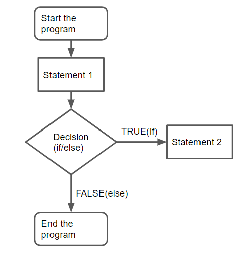
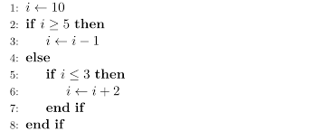

# 25차시 명령 나열하기

알고리즘: 문제 해결을 위한 절차

컴퓨터에는 명령을 나열하는 형태로 기술한다.

알고리즘의 특징

- 입력
- 출력
- 정확성
- 유한성
- 효율성
- 일반성
- 확정성

표현 방식

순서도(flowchart)

의사코드(pseudo-code)

## 알고리즘의 효율성

알고리즘이 수행되는 시간: 시간 복잡도

차지하는 기억 공간: 공간 복잡도

- 최상의 경우
- 최악의 경우
- 평균의 경우

## 제어 구조

1. 순차 구조

   말 그대로 순차적으로 실행함

2. 선택 구조

   조건식의 참, 거짓에 따라 선택적으로 실행하는 구조

## 반복 구조

특정 문장들을 반복해서 실행하는 문장 구조

## 문제

1. 임의의 숫자로 n개 구성된 배열에서 반복문을 통해 0번 인덱스 부터 탐색하여 원하는 숫자를 찾는 게임을 하자.

   그렇다면 최선, 최악의 경우 각각 몇 번의 탐색이 이루어질까?

2. 실제 자바의 for문을 통해 다음과 같은 코드를 작성할 수 있다.

   `for(int i=0; i<n; i++)`

   그렇다면 이 for문을 while문으로 바꾸려면 어떻게 작성할 수 있을까?

3. 변수 a와 b가 있다고 가정하자.

   a와 b 둘 다 10보다 크면 10을 출력하고

   둘 중 하나만 10보다 크면 5를 출력하고

   둘다 10보다 작으면 0을 출력하는 코드를 작성하기 위해 어떻게 작성해야 할까?

   (수도코드로 작성해도 된다.)
