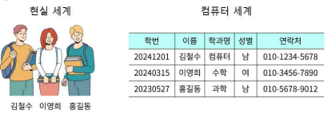
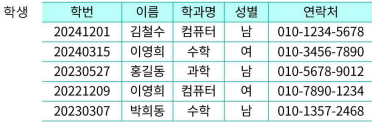
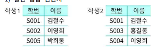
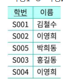
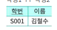
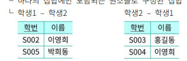
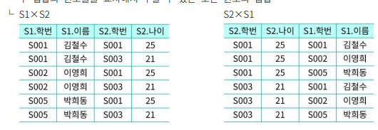
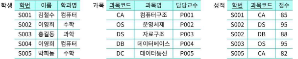
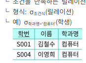

### 31차시 관계형 데이터베이스

Why?
책과 같은 출판물에는 ISBN이 발행
-> 각각의 단계별로 표 형태를 만들어 놓고 연결학 ㅔ되면 특정 도서에 대한 고유번호가 나오게 되는데, 여러 개의 정보를 연결하여 새로운 정보를 얻을 수 있도록 구조화해 놓은 것 

-> 관계형 데이터베이스

### 데이터 모델
1) 데이터 모델 (data model)
* 현실 세계의 데이터 구조를 컴퓨터 세계의 데이터 구조로 기술하는 도구
* 데이터베이스를 구축할 때 체계화된 구조를 명시하기 위한 도구

2) 데이터 모델의 예

### 데이터 모델링
1) 데이터 모델링(data modeling)
* 데이터베이스화 해야 하는 데이터를 분석하여 데이터의 구조, 관계, 제약조건을 정의하는 과정
* 개념적 모델링, 논리적 모델링, 물리적 모델링으로 구분됨

2) 개념적 모델링
* 데이터베이스로 나타내려는 현실 세계를 구체화하기 위한 밑그림 작업을 하는 과정
* 엔티티(entity), 속성(attribute), 관계(relation) 정의

3) 논리적 모델링
* 개념적으로 정리된 데이터 모델을 물리적으로 구현하기 위해 형식을 정리하는 과정
* 데이터의 정확성과 안정성을 보장하기 위해 엔티티, 속성, 관계에 대한 표현과 규칙 정의
- 엔티티 : 테이블 or 리스트 형식
- 속성 : 칼럼 or 리스트의 원소
- 관계 : 기본키(primary key), 외래키(foreign key) 등
* 기본키 : 여러 개체 중 하나를 구분하는 값(예: 교수번호, 학번, 과목번호)
* 외래키 : 다른 개체의 값을 참조할 수 있는 키

### 물리적 모델링
* 물리적 데이터베이스를 구현하기 위한 정보를 정리하는 과정
* 구조(structure), 연산(operator), 제약 조건(constraint) 등을 정의
* 예) 전화번호 010-1234-5678
* 구조 : 숫자-숫지-숫자
* 연산 : 저장, 수정, 삭제 공유
* 제약조건: 숫자(0~9)만 가능

## 관계형 데이터 모델
1) 관계형 데이터 모델(relation data model)
* 테이블 형식으로 데이터를 정의하고 설명하는 모델

2) 릴레이션의 구조

* 릴레이션(relation)
* 개체를 행과 열로 구성되는 테이블 형태로 표현한 것
* 속성 (attribute)
* 릴레이션을 구성하는 각자 열
* <학생> 릴레이션은 "학번", "이름", "학과명", "성별", "연락처" 속성이 있음
* 차수 (degree)
- 한 릴레이션을 구성하는 속성의 수
- <학생> 릴레이션의 차수는 5임

* 도메인(domain)
- 하나의 속성이 가질 수 있는 값과 범위
- 예) 학과명 도메인 : (컴퓨터, 수학, 과학)
성별 도메인 : (남, 여)

### 튜플(tuple)
* 릴레이션을 구성하는 각자의 행
* 각 속성의 값들을 집합으로 구성

### 기수 (cardinality)
* 한 릴레이션의 튜플의 수
* <학생> 릴레이션의 기수는 5임

### 키(key)
* 각 튜플을 유일하게 식별할 수 있는 속성 또는 속성의 집합
* <학생> 릴레이션의 키 (ex. 학번, 연락처, 학번+이름, 학번+연락처 etc)
* 후보키(cardinate key)
- 유일성과 최소성을 모두 만족하는 키
- <학생> 릴레이션의 후보키 : (학번),(연락처)
* 기본키(primary key)
- 후보키 중에서 대표로 선정된 키
- <학생> 릴레이션의 기본키 : (학번)
* 대체키 (alternative key)
- 기본키로 선정되지 못한 후보키
- <학생> 릴레이션에서 (학번)이 기본키로 선정되는 경우 대체키는 (연락처)가 됨
* 외래키(foreign key)
- 다른 릴레이션의 기본키를 참조하는 키
- 예: <성적> 릴레이션의 학번이 <학생> 릴레이션의 학번을 참조할 경우 <학생> 릴레이션의 학번이 외래키가 됨

### 관계 데이터 연산
1) 일반 집합 연산자

* 합집합(union)
- 두 집합의 원소들을 모두 합치는 연산
- 학생1 U 학생2
- 

* 교집합(intersection)

- 두 집합에 공통되게 포함되어 있는 원소들의 집합
- 학생1 ^  학생

* 차집합 (difference)
- 하나의 집합에만 포함되는 원소들로 구성된 집합

* 교차곱(cartesian product, 카티션 곱)
- 두 집합의 원소들을 교차해서 구할 수 있는 모든 원소의 집합

2) 순수 관계 연산자

* 선택(select)
- 조건을 만족하는 릴레이션의 수평적 부분 집합을 구하는 연산

* 추출(project)
- 조건을 만족하는 릴레이션의 수직적 부분 집합을 구하는 연산

* 조인(join)
- 공통 속성을 중심으로 두 개의 릴레이션을 하나로 합치는 연산

### 3줄 요약
- 데이터 모델은 현실 세계를 컴퓨터 세계에 표한하기 위한 기술 도구로, 개념적. 논리적. 물리적 방식으로 모델링 할 수 있다.
- 관계형 데이터 모델은 속성으로 구성된 릴레이션으로 현실 세계를 표현한 것이다.
- 관계형 데이터 연산은 일반관계연산자(합집합, 교집합, 차집합, 교차곱)와 순수관계연산자(선택, 추출, 조인)기 있다.

### 문제
1) 관계 데이터 연산 중, 일반 집합 연산자로 두 집합의 원소들을 모두 합치는 연산을 뭐라고 하나요?
- 합집합 (union)

2) 관계형 데이터 모델을 정의하시오.
- 테이블 형식으로 데이터를 정의하고 설명하는 모델

3) 개념적 모델링은 A,B,C를 정의하게 되는데 A,B,C에 대해 기술해주세요
- 엔티티(entity), 속성(attribute), 관계(relation)